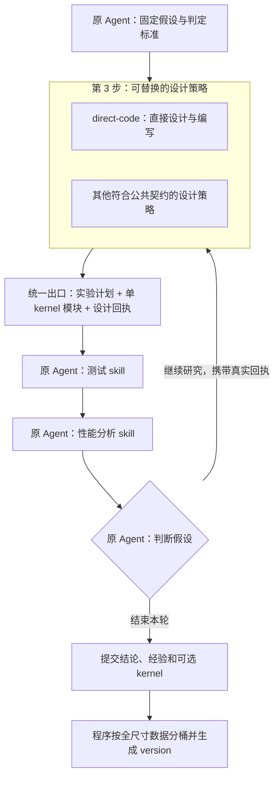

# 可替换的 kernel 实验设计步骤

状态：设计提案，尚未实现。本文定义可替换步骤的公共接口与接入方式；新配置、工具、类型和目录均为拟议接口。

公共架构依据：[单 HW workspace 仓库级改造](2026-09-25-single-hardware-workspace-restructure.md)单独定义整个仓库的配置、目录、身份、存储与迁移。本设计只定义第 3 步的可替换策略，并消费该公共架构；仓库改造不依赖本策略上线。

## 1. 本次设计的边界

把研究循环中第 3 步“设计实验并编写 kernel”定义为一个可替换的**设计策略**。现有直接编写方式通过同一接口接入，其他实现按公共契约替换。外层研究循环只依赖统一输入输出。



**策略是同一个 Agent 使用的一组方法和校验器。** 加载策略、修改设计、修正 kernel、读取实验反馈均发生在原研究会话中。MVP 沿用一份 persona、两个测试/分析 skill；策略说明作为参考材料加载到原上下文。

实验反馈通过已有步骤 4、5 返回的回执连接：策略读取历史证据，形成下一轮设计。策略接口本身不隐藏启动 SSH、测试、profile 或集成的动作。Agent 仍选择何时调用原有工具。

## 2. 从用户设计保留的语义

| 用户设计 | MVP 中的表达 |
| --- | --- |
| 一个 HW 一个 workspace | 仓库根绑定唯一真实硬件目标；不同 HW 使用独立仓库实例；多个 op/dtype 在同一实例内共享预测器、知识库与执行队列 |
| 产物种类 → op → dtype | 源码、IR、case 集、实验、测量、版本和报告分别归类；shape 保留在 case、支持域和路由规则中 |
| 公式定义与 CPU 精确结果 | 固定算子语义和独立 CPU oracle；任何策略都引用同一份，不按候选的输出修改标准 |
| 一个算子拥有多个 kernel | 每个提交 kernel 分别完成全尺寸测试；周期末根据真实数据装配路由 version |

当前源码只支持 `qmq-v1` / int8，且 suite 不接受同 shape 的不同 dtype/layout。这是待迁移的实现限制。新设计从配置、身份与目录开始容纳同一 HW 下多个 op/dtype，每组各自绑定算子契约、oracle 和 suite；`qmq-v1/int8` 作为首个真机接入组。新增算子的契约检查和 runner 适配按其契约实现，不能只增加目录就声称已支持。

“CPU 精确结果”指按固定算子契约定义的参考结果。整数累加、浮点舍入、溢出与容差各自按该契约处理；不能笼统承诺所有浮点变换逐位等价。

### 2.1 本步骤消费的公共仓库契约

宿主向策略传入唯一 HW workspace、当前 `op_id/dtype_id`、契约、oracle、suite 和环境引用。策略使用统一路径服务保存本组设计产物，不自行建立 HW 子仓库、私有 catalog 或 shape 目录。

全尺寸、候选身份、知识共享、版本通道和旧证据迁移均按[仓库级改造方案](2026-09-25-single-hardware-workspace-restructure.md)执行。不同 op/dtype 的材料可以启发设计；当前候选与其测试证据必须匹配宿主固定的目标组。

策略返回当前组的单 kernel 候选。后续程序仍用该组的真实全尺寸数据自动寻找 shape 优势区间并生成 version；设计策略不自行分桶或发布版本。

## 3. 可插拔边界与稳定契约

### 3.1 职责边界

| 层 | 负责的内容 | 替换时的影响 |
| --- | --- | --- |
| 研究外壳 | 同一 session、假设、预算、suite、材料、构建/测试/profile、交付与自动集成 | 通过公共契约消费候选和产物引用 |
| 设计策略 | 实验方法、Agent 编写步骤、内部产物及专属校验 | 整体可替换，输出继续符合公共契约 |

现有直接编写方式以 `direct-code@1` 接入本插件内部的策略注册表。新增策略实现同一契约、登记 ID，并通过公共契约验收。

### 3.2 输入和输出

以下是设计类型，不是当前已存在的 TypeScript API：

```ts
type Ref = string; // 宿主验证来源的文件或内容寻址引用

interface DesignContext {
  workspace_ref: Ref;          // 唯一 HW 绑定与 workspace 身份
  target: { op_id: string; dtype_id: string };
  research_id: string;          // 宿主绑定，Agent 不能另换身份
  experiment_id: string;
  hypothesis_revision_ref: Ref;
  operator_contract_ref: Ref;
  oracle_ref: Ref;
  case_suite_ref: Ref;
  hardware_report_ref: Ref;
  initial_material_refs: Ref[]; // 启发材料，仍允许阅读其他文件
  prior_evidence_refs: Ref[];   // 原有 build/test/profile/analysis 回执
  budget_ref: Ref;             // 复用整轮预算，不另开无限预算
}

interface DesignResult {
  design_ref: Ref;             // 工具冻结的身份、版本、校验及产物哈希
  experiment_plan_ref: Ref;    // 对照、干预、预测、采样及判定规则
  candidates: Array<{
    kernel_path: string;       // 现有 kernel.json 所在目录
    role: "control" | "intervention" | "ablation";
    validation_ref: Ref;
  }>;
  internal_artifact_refs: Ref[]; // 外层保存引用，不解释其私有 schema
}
```

`DesignResult` 只在产物已准备好时返回，至少包含一个候选。中间的 `NEEDS_REVISION`、`BLOCKED` 返回诊断及已保存草稿，不冒充完成，也不强制结束研究。研究仍可因证据或预算限制以零提交 kernel 收尾。

公共候选的代码出口继续是现有 `KernelModule`：`kernel_id/revision`、ABI、`symbol_prefix`、launcher、device/host 源码、依赖、`supported_case_ids`、硬件作用域与资源限制。宿主为其附加固定的 workspace/op/dtype 身份，检查 ABI、case 与本组配置一致。公共出口不包含 version、shape 分桶或“已验证最优区间”。

冻结设计时，工具保存候选内容哈希、策略版本及其依赖引用。构建入口核对设计产物与待构建源码相符，再按现有逻辑生成 `source_hash`、构建和测试身份。`READY` 只表示设计侧已完成所要求的检查；真实构建、正确性与性能以之后的回执为准。

### 3.3 配置与同会话调用

拟议配置：

```json
{
  "design": {
    "strategy": "direct-code@1",
    "options": {}
  }
}
```

`meteor_start` 可带同结构的本轮覆盖项；省略时读取项目配置。宿主解析注册的版本并固定代码、说明、schema、校验器和依赖引用的哈希，写入 manifest 与启动包。旧工程缺少配置时走 `direct-code@1`，明确报告实际选择；未知 ID、版本或不兼容选项直接报配置错误。默认策略的变更须完成相应契约与真机验收。

新增一个公共工具入口 `meteor_design`：

| action | 行为 |
| --- | --- |
| `open` | 绑定 experiment 与策略，返回本策略说明、阶段列表、草稿位置与固定上下文引用 |
| `check` | 校验指定阶段的草稿与父产物哈希，返回结构化诊断及检查覆盖范围 |
| `freeze` | 检查所需阶段与候选对应关系，生成不可变 `DesignResult`；不构建、不测量 |
| `compare` | 读取本次设计和既有实验回执，按所选策略生成反馈；不启动采集、不判定研究假设 |

每个 action 的必填字段由明确的输入 union 校验；研究/session 身份由宿主注入。工具 dispatch 到所选策略，`direct-code` 的 stages 可以只有实验计划与候选模块。`compare` 不适用时显式返回 `NOT_APPLICABLE`。

策略包提供 `describeStages / validateStage / freezeArtifacts / compareEvidence` 四个内部接口。它们运行确定性文件校验和证据处理；LLM 编写过程由原 Agent 根据 `guide.md` 执行，不在接口内部新建 Agent。策略代码随可信项目模板固定，Agent 草稿中的字符串不能指定可执行模块或 shell 命令。

一轮 research 默认固定一个策略。确需更换时，通过显式新 design attempt 选择本轮快照内已登记的策略版本、保留理由和旧产物，session 保持不变；新安装的版本供后续 research 使用。不能因校验失败静默切换以绕过检查。构建产物精确绑定其自己的设计回执。

## 4. 文件布局与现有代码接缝

### 4.1 模板与扩展目录

```text
templates/project/tools/meteor/design/
  contracts.ts                 # 公共 DesignContext/Result/诊断
  registry.ts                  # 策略注册
  service.ts                   # open/check/freeze/compare；宿主绑定身份
  strategies/
    direct-code/               # manifest、guide、plan/module 校验
    <strategy-id>/             # 可替换实现及其内部文件
```

该目录位于已经冻结的 `tools/meteor` 下，策略说明和实现随研究快照固定。所选策略通过一份 `guide.md` 向原 Agent 提供方法与修订指导。

### 4.2 本步骤使用的分类产物

整体目录定义在[仓库级改造方案](2026-09-25-single-hardware-workspace-restructure.md)。设计策略仅使用其中这些公共位置：

```text
research/<op>/<dtype>/<research_id>/drafts/
  designs/<design_id>/                  # Agent 编写的设计草稿
  kernels/<kernel_id>/<revision>/       # 当前可写源码
kernels/<op>/<dtype>/<kernel_id>/<revision>/ # 正式模块出口
experiments/<op>/<dtype>/<research_id>/<experiment_id>/
  plan.json / analysis.json / artifact-refs.json
comparisons/<op>/<dtype>/<comparison_id>/
  ...                                  # 策略反馈及其引用
```

策略的内部产物通过 `internal_artifact_refs` 返回，按公共仓库的产物分类归档。正式产物由工具冻结，Agent 持续在自身作者目录修改草稿。公共路径、身份与写入权限由仓库 runtime 提供，不由策略重新规定。构建、测量和版本发布仍使用公共工具与其他分类目录。

### 4.3 只为设计步骤新增的接缝

以下修改建立在公共 workspace/target 契约上；全局目录迁移、原始身份键、数据库升级和多算子适配见独立仓库级方案。

| 现有接点 | 策略接入修改 |
| --- | --- |
| `prompts/meteor.md` 自主实验循环第 3、4 项 | 改为按选中策略设计与编写；测试、分析、假设判定仍用原上下文 |
| `contracts.ts`、配置加载、`meteor_start` schema | 在公共 workspace/target 配置上增加可选 design 选择，固定策略版本/哈希 |
| `research.ts`、`host.ts` 启动包 | 附加策略及其依赖引用；所用策略文件随公共快照机制固定 |
| `src/research-tools.ts` 与 `src/project.ts` | 注册一个 `meteor_design` 并加载策略模块；使用公共路径、身份和写入校验 |
| `meteor_kernel_build` / `kernel-build.ts` | 增加可选 `design_ref`，核对精确候选内容与设计回执；使用既有单 kernel ABI |
| 两个已有 skill | 说明设计回执和实验反馈如何往返；保持 Agent 主动调用 |
| 提交类型/schema、store/query、migration | 增加可选设计/反馈引用，复用公共 scope、事务与新鲜度机制 |

## 5. MVP 的实施顺序和验收

前置公共接口由仓库级改造提供；它可以先独立上线并沿用原 Agent 的直接编写流程。本节只验收设计步骤的公共接缝。

1. 用 `direct-code@1` 接入统一接口，验证相同候选仍可通过公共 build/test/profile/submission。
2. 用隔离的替换策略夹具验证注册、配置、快照、输入输出与诊断转发；夹具通过只证明接口可替换。
3. 用已接入的直接编写策略完成一次真实研究，由同一 subagent 设计、编写、测试、分析和修订，每个提交 revision 全尺寸测试完整，再由既有程序自动集成。

验收要求：

- 替换策略时，外层 build/test/profile 和 kernel ABI 无需专用分支。
- 策略消费公共 workspace/target 身份与分类路径，候选和证据属于当前目标组。
- 未知策略、无效输出、过期检查或候选源码与设计回执不一致时，工具返回明确诊断。
- session 保持连续，测试与性能分析由原 Agent 调用，执行经过既有预算与设备队列。
- 设计回执不能代替真实构建、正确性或性能证据；历史成绩不能绑定到新源码。
- 所有拟提交 kernel 继续满足独立全尺寸交付门槛；路由与 version 消费真实全尺寸成绩。

## 6. 决策记录与依据

| 决策 | 依据与影响 |
| --- | --- |
| 抽出第 3 步的策略包 | 统一实验设计与 kernel 编写的输入输出，保留现有研究循环 |
| 原 Agent 使用策略说明 | 连续保留假设、实验历史和反馈，沿用一份 persona 与两个 skill |
| 测量通过公共回执反馈 | 复用设备队列、预算和证据门槛，由原 Agent 决定实验顺序 |
| 依赖公共仓库契约 | 策略使用统一 HW/target 身份与分类路径，替换时无需再次迁移仓库 |

**人类设计：** 设计策略只替换实验设计/编写 kernel 这一步；一个 HW 一个仓库实例，所有 op/dtype/shape 共享 workspace，产物按种类/op/dtype 分类；shape 与 version 仍自动寻找并装配实测优势区间；保留已有单会话、独立全尺寸测试与周期末自动集成要求。

**Agent 补充设计：** 设计步骤输入输出、策略注册、单工具四种 action、版本/hash 冻结与接口验收。公共 workspace、目录分类、身份和迁移由独立仓库级设计负责。

**验证状态：** 已对照现有 persona、构建 ABI、快照、写入范围、提交 schema、知识库和集成入口核查设计接缝；新接口尚未实现或完成真机验收。
