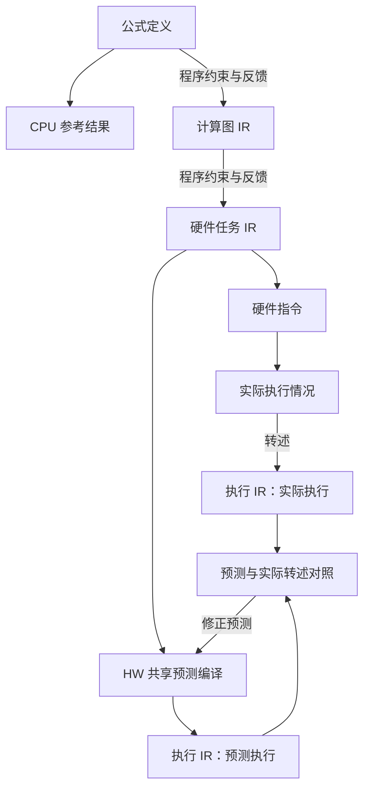

# 可替换的 kernel 实验设计步骤与 IR 层级

状态：设计提案，尚未实现。保留人类确定的 IR 层级、预测与实际执行对照、Agent 与程序的职责，以及可替换步骤的公共接口。第 4.1 节定义计算图 v1 的 28 个计算原语及数值语义，第 4.2 节用它们完整表达当前量化算子。旧稿的 IR 文件格式、字段和证据 schema 继续撤回；本次定义不恢复旧 schema。

公共架构依据：[单 HW workspace 仓库级改造](2026-09-25-single-hardware-workspace-restructure.md)单独定义整个仓库的配置、目录、身份、存储与迁移。本设计只定义第 3 步的可替换策略，并消费该公共架构；仓库改造不依赖本策略上线。

## 1. 本次设计的边界

把研究循环中第 3 步“设计实验并编写 kernel”定义为一个可替换的**设计策略**。分层 IR 方法放在这一步内部，现有直接编写方式通过同一接口接入。外层研究循环只依赖统一输入输出。


**策略是同一个 Agent 使用的一组方法和校验器。** 加载策略、修改设计、修正 kernel、读取实验反馈均发生在原研究会话中。MVP 沿用一份 persona、两个测试/分析 skill；策略说明作为参考材料加载到原上下文。

实验反馈通过已有步骤 4、5 返回的回执连接：策略读取历史证据，形成下一轮设计。策略接口本身不隐藏启动 SSH、测试、profile 或集成的动作。Agent 仍选择何时调用原有工具。

## 2. 从用户设计保留的语义

| 用户设计 | MVP 中的表达 |
| --- | --- |
| 一个 HW 一个 workspace | 仓库根绑定唯一真实硬件目标；不同 HW 使用独立仓库实例；多个 op/dtype 在同一实例内共享预测器、知识库与执行队列 |
| 产物种类 → op → dtype | 源码、IR、case 集、实验、测量、版本和报告分别归类；shape 保留在 case、支持域和路由规则中 |
| 公式定义与 CPU 精确结果 | 固定算子语义和独立 CPU oracle；任何策略都引用同一份，不按候选的输出修改标准 |
| 公式定义 → 计算图 IR → 硬件任务 IR | 保留逐层编写与程序约束反馈；计算原语见第 4.1 节，硬件任务表示另行设计 |
| 计算图采用基础运算 DAG | 按用户提供图的形式表达完整数据依赖；计算节点降到加减乘除、比较等基础操作，再转换为硬件任务 |
| 硬件任务 IR → 硬件指令 → 实际执行情况 → 执行 IR | 实际运行的情况转述到执行 IR 层，供分析与对照 |
| 硬件任务 IR → 预测编译 → 执行 IR | 使用 HW 共享的预测编译能力，与实际执行转述对照并修正预测 |
| 预测编译规则与 IR 编写技巧 | 保留两类结构化知识及其共享关系，具体字段另行设计 |
| Agent 编写与转换，程序实现约束 | 同一个 Agent 分步完成，每步接收程序反馈 |
| 一个算子拥有多个 kernel | 每个提交 kernel 分别完成全尺寸测试；周期末根据真实数据装配路由 version |

当前源码只支持 `qmq-v1` / int8，且 suite 不接受同 shape 的不同 dtype/layout。这是待迁移的实现限制。新设计从配置、身份与目录开始容纳同一 HW 下多个 op/dtype，每组各自绑定算子契约、oracle 和 suite；`qmq-v1/int8` 作为首个真机接入组。新增算子的契约检查和 runner 适配按其契约实现，不能只增加目录就声称已支持。

“CPU 精确结果”指按固定算子契约定义的参考结果。整数累加、浮点舍入、溢出与容差各自按该契约处理；不能笼统承诺所有浮点变换逐位等价。

### 2.1 本步骤消费的公共仓库契约

宿主向策略传入唯一 HW workspace、当前 `op_id/dtype_id`、契约、oracle、suite 和环境引用。策略使用统一路径服务保存本组设计产物，不自行建立 HW 子仓库、私有 catalog 或 shape 目录。

全尺寸、候选身份、知识共享、版本通道和旧证据迁移均按[仓库级改造方案](2026-09-25-single-hardware-workspace-restructure.md)执行。不同 op/dtype 的材料可以启发设计；当前候选与其测试证据必须匹配宿主固定的目标组。

策略返回当前组的单 kernel 候选。后续程序仍用该组的真实全尺寸数据自动寻找 shape 优势区间并生成 version；设计策略不自行分桶或发布版本。

## 3. 可插拔边界与稳定契约

### 3.1 职责边界

| 层 | 负责的内容 | 替换时的影响 |
| --- | --- | --- |
| 研究外壳 | 同一 session、假设、预算、suite、材料、构建/测试/profile、交付与自动集成 | 通过公共契约消费候选和产物引用 |
| 设计策略 | 实验方法、Agent 编写步骤、内部产物及专属校验 | 整体可替换，输出继续符合公共契约 |
| HW 共享预测器 | 本 HW 的预测编译方法及规则知识 | 供分层策略使用，各 op/dtype 共享 |

现有直接编写方式以 `direct-code@1` 接入，分层方法保留 `layered-ir@1` 策略入口；二者均为拟议接口。分层策略采用第 4 节的计算原语；各层存储表示、转换器与校验器尚未实现。新增策略实现同一公共契约并登记 ID。

### 3.2 输入和输出

以下是设计类型，不是当前已存在的 TypeScript API：

```ts
type Ref = string; // 宿主验证来源的文件或内容寻址引用

interface DesignContext {
  workspace_ref: Ref;          // 唯一 HW 绑定与 workspace 身份
  target: { op_id: string; dtype_id: string };
  research_id: string;          // 宿主绑定，Agent 不能另换身份
  experiment_id: string;
  hypothesis_revision_ref: Ref;
  operator_contract_ref: Ref;
  oracle_ref: Ref;
  case_suite_ref: Ref;
  hardware_report_ref: Ref;
  initial_material_refs: Ref[]; // 启发材料，仍允许阅读其他文件
  prior_evidence_refs: Ref[];   // 原有 build/test/profile/analysis 回执
  budget_ref: Ref;             // 复用整轮预算，不另开无限预算
}

interface DesignResult {
  design_ref: Ref;             // 工具冻结的身份、版本、校验及产物哈希
  experiment_plan_ref: Ref;    // 对照、干预、预测、采样及判定规则
  candidates: Array<{
    kernel_path: string;       // 现有 kernel.json 所在目录
    role: "control" | "intervention" | "ablation";
    validation_ref: Ref;
  }>;
  internal_artifact_refs: Ref[]; // 外层保存引用，不解释其私有 schema
}
```

`DesignResult` 只在产物已准备好时返回，至少包含一个候选。中间的 `NEEDS_REVISION`、`BLOCKED` 返回诊断及已保存草稿，不冒充完成，也不强制结束研究。研究仍可因证据或预算限制以零提交 kernel 收尾。

公共候选的代码出口继续是现有 `KernelModule`：`kernel_id/revision`、ABI、`symbol_prefix`、launcher、device/host 源码、依赖、`supported_case_ids`、硬件作用域与资源限制。宿主为其附加固定的 workspace/op/dtype 身份，检查 ABI、case 与本组配置一致。公共出口不包含 version、shape 分桶或“已验证最优区间”。

冻结设计时，工具保存候选内容哈希、策略版本及其依赖引用。构建入口核对设计产物与待构建源码相符，再按现有逻辑生成 `source_hash`、构建和测试身份。`READY` 只表示设计侧已完成所要求的检查；真实构建、正确性与性能以之后的回执为准。

### 3.3 配置与同会话调用

拟议配置：

```json
{
  "design": {
    "strategy": "direct-code@1",
    "options": {}
  }
}
```

`meteor_start` 可带同结构的本轮覆盖项；省略时读取项目配置。宿主解析注册的版本并固定代码、说明、schema、校验器和依赖引用的哈希，写入 manifest 与启动包。旧工程缺少配置时走 `direct-code@1`，明确报告实际选择；未知 ID、版本或不兼容选项直接报配置错误。默认策略的变更须完成相应契约与真机验收。

新增一个公共工具入口 `meteor_design`：

| action | 行为 |
| --- | --- |
| `open` | 绑定 experiment 与策略，返回本策略说明、阶段列表、草稿位置与固定上下文引用 |
| `check` | 校验指定阶段的草稿与父产物哈希，返回结构化诊断及检查覆盖范围 |
| `freeze` | 检查所需阶段与候选对应关系，生成不可变 `DesignResult`；不构建、不测量 |
| `compare` | 读取本次设计和既有实验回执，按所选策略生成反馈；不启动采集、不判定研究假设 |

每个 action 的必填字段由明确的输入 union 校验；研究/session 身份由宿主注入。工具 dispatch 到所选策略，`direct-code` 的 stages 可以只有实验计划与候选模块。`compare` 不适用时显式返回 `NOT_APPLICABLE`。

策略包提供 `describeStages / validateStage / freezeArtifacts / compareEvidence` 四个内部接口。它们运行确定性文件校验和证据处理；LLM 编写过程由原 Agent 根据 `guide.md` 执行，不在接口内部新建 Agent。策略代码随可信项目模板固定，Agent 草稿中的字符串不能指定可执行模块或 shell 命令。

一轮 research 默认固定一个策略。确需更换时，通过显式新 design attempt 选择本轮快照内已登记的策略版本、保留理由和旧产物，session 保持不变；新安装的版本供后续 research 使用。不能因校验失败静默切换以绕过检查。构建产物精确绑定其自己的设计回执。

## 4. 保留的层级设计

以下层级与职责来自人类手绘设计，继续作为架构要求。计算图的原语与数值语义定义在本节；硬件任务 IR、执行 IR 的具体表示另行设计。



- **层级顺序：** 公式定义、计算图 IR、硬件任务 IR、执行 IR 的关系保留；硬件指令与实际执行形成实测一支。
- **共同的执行层：** 预测结果和实际执行转述都落在执行 IR 这一层，用于对照和修正预测。具体表示与对照规则待设计。
- **编写与反馈：** 各层 IR 的编写和转换由同一个研究 Agent 分步完成，程序实施约束并逐步返回反馈。核函数的真实构建、测试和性能采集继续使用现有工具与 skill。
- **硬件共享：** 一个 HW workspace 共用预测编译能力，其 op/dtype 复用相关规则。
- **知识分类：** 经验库保留“预测编译规则”和“IR 编写技巧”两类知识，按已确定的仓库结构共享与归档。
- **研究边界：** 分层设计在第 3 步内部运行；测试和分析反馈回到原 Agent。kernel 的全尺寸表现、假设结论及周期末自动集成继续分别处理。

### 4.1 计算图 IR v1：28 个计算原语

计算节点限定为下表的 **28 个标量原语**。每个节点产生一个带类型的值，边引用该值；同一个值可以被多个节点使用。图按[用户提供的 DAG](assets/quant_matmul_relu_quant_full_dag_npu_mapping.svg)组织，张量运算由这些节点及其重复结构组成。

类型记号：`I` 为 `i8/i16/i32/i64/u8/u16/u32/u64`；`S` 为其中的有符号整数；`F` 为 `f16/bf16/f32/f64`；`N = I | F`；`V = N | bool`。同一签名内重复的类型字母表示**完全相同的 dtype**。常量也有 dtype；除显式 `cast` 外没有隐式类型提升、混合精度或广播。类型集合表示 IR 的表达能力，具体 HW 支持由映射检查确定。

| 类别 | 原语 | 输入 → 输出 | 定义 |
| --- | --- | --- | --- |
| 算术 | `add`、`sub`、`mul` | `(N, N) → N` | 加、减、乘 |
| 浮点除法 | `div` | `(F, F) → F` | 浮点除法，在结果 dtype 舍入 |
| 整数除法 | `idiv` | `(I, I) → I` | 整数商向零截断：`idiv(-5, 2) = -2` |
| 整数余数 | `imod` | `(I, I) → I` | `a - idiv(a,b) * b`：`imod(-5, 2) = -1` |
| 二元极值 | `min`、`max` | `(N, N) → N` | 只比较两个值并产生较小/较大值 |
| 融合乘加 | `fma` | `(F, F, F) → F` | 计算 `a*b+c`，中间乘积不舍入，最终只舍入一次 |
| 相等比较 | `eq`、`ne` | `(V, V) → bool` | 相等、不等 |
| 大小比较 | `lt`、`le`、`gt`、`ge` | `(N, N) → bool` | 小于、小于等于、大于、大于等于 |
| 布尔逻辑 | `and`、`or` | `(bool, bool) → bool` | 逻辑与、逻辑或 |
| 布尔取反 | `not` | `bool → bool` | 逻辑非 |
| 位运算 | `bit_and`、`bit_or`、`bit_xor` | `(I, I) → I` | 按位与、或、异或 |
| 按位取反 | `bit_not` | `I → I` | 在本 dtype 位宽内逐位取反 |
| 左移 | `shl` | `(I, u32) → I` | 左移，低位补零，舍弃移出的高位 |
| 逻辑右移 | `lshr` | `(I, u32) → I` | 右移，高位补零 |
| 算术右移 | `ashr` | `(S, u32) → S` | 右移，高位填充原符号位 |
| 条件选值 | `select` | `(bool, V, V) → V` | `select(p,a,b)`：p 为真取 a，否则取 b |
| 数值转换 | `cast<dst>` | `N → dst`，`dst ∈ N` | 按下面的转换规则产生新 dtype 的数值 |
| 浮点取整 | `round<mode>` | `F → F` | 取整后仍为原浮点 dtype；mode 必须显式指定 |

**数值规则也是原语定义的一部分：**

1. **整数。** `add/sub/mul` 保留结果低 w 位，有符号类型按二补码解释；需要更大数域时先 `cast` 扩宽。`idiv/imod` 要求除数非零，排除有符号 `MIN / -1` 的溢出情形。比较与极值按 dtype 的有符号/无符号解释。移位量满足 `0 ≤ s < w`，不自动对位宽取模。
2. **浮点。** `add/sub/mul/div/fma` 的基准语义为结果 dtype 的 nearest-even 舍入，保留 subnormal；每个节点独立舍入。`add(mul(a,b),c)` 有两次舍入，`fma(a,b,c)` 只有一次。NaN/Inf 及浮点除零遵循 IEEE 浮点数值规则，例如非零有限数除以零得到相应符号的 Inf，`0/0` 得到 NaN；不承诺 NaN payload 或异常标志。浮点 `min/max` 遇任一 NaN 返回 NaN；对两种零，`min(-0,+0)=-0`、`max(-0,+0)=+0`。比较遇 NaN 时只有 `ne` 为真，其余比较为假。
3. **转换。** `I→I` 把原整数值对目标位宽取模，再按目标符号解释，覆盖扩宽、缩窄和符号改变。`I→F`、`F→F` 按目标格式 nearest-even 舍入；`F→I` 向零截断，并要求输入有限且截断后的整数在目标范围内。饱和转换通过 `min/max` 限幅后再 `cast` 表达。
4. **取整。** mode 为 `rne`（最近，恰好一半取偶数）、`rtz`（向零）、`floor`（向负无穷）、`ceil`（向正无穷）。例如 `round<rne>(2.5)=2.0`、`round<rne>(3.5)=4.0`；它不负责改变 dtype 或限幅。NaN 返回 NaN，Inf 保持其符号；结果为零时保留输入符号。
5. **选值。** `select` 消费已经定义的两个值，没有短路含义，不能用它掩盖另一输入子图中的非法整数除法、越界索引或转换。需要避免非法除数时先选出安全除数，再做除法。

**复合表达的固定展开：** `relu(x) = max(x, 0)`；`clip(x,l,h) = min(max(x,l),h)`；整数 `floordiv(a,b)` 可由 `idiv/imod`、符号比较和 `select` 在非整除且异号时把商减一。常量、输入元素引用、输出绑定、索引范围和重复子图属于图结构；`matmul`、`reduce_sum`、`reduce_max` 等阅读分组必须能展开到表中原语。v1 不设任意外部 `call` 逃逸口；新增基础运算须在后续原语版本中补齐签名、数值规则和参考求值。

**借鉴范围：** 算术、比较、逻辑、选值及转换的划分参考 [TVM v0.26.0 的表达式节点](https://github.com/apache/tvm/blob/v0.26.0/include/tvm/tirx/expr.h)；位运算、取整和 FMA 的参考入口为其 [tirx/op.py](https://github.com/apache/tvm/blob/v0.26.0/python/tvm/tirx/op.py)。上表是 Meteor 自行选定的集合与命名，数值规则也由本节明确规定。HW 映射可使用一条指令或指令组合；近似除法、FTZ 或融合与上述基准有差异时，须记录差异、核对算子契约的容许范围并验证，不能静默改写原语含义。

### 4.2 用原语完整表达 quant_matmul_relu_quant

下面是计算图的文本表达。`m/n/k` 为索引重复的记号，不指定串行或并行调度；每条赋值定义一个值及其依赖。所有 `0/1/127/-128` 均显式标成 `f32`。本例使用的计算原语只有 **9 个：`cast, mul, add, max, min, div, gt, select, round`**。

```text
# 每个 (m,n,k) 的乘积；先扩宽，避免在 i8 内乘法溢出
lhs[m,k] = cast<i32>(x1[m,k])
rhs[n,k] = cast<i32>(x2[n,k])
p[m,n,k] = mul(lhs[m,k], rhs[n,k])

# K 个 i32 乘积接成 add 树
acc[m,n] = tree(add, p[m,n,0:K])

# 每一次乘 scale 都产生独立的 f32 结果
v0[m,n] = cast<f32>(acc[m,n])
v1[m,n] = mul(v0[m,n], x1Scale[m])
v2[m,n] = mul(v1[m,n], x2Scale[n])
a[m,n]  = max(v2[m,n], f32(0))

# 同一行的 N 个激活值接成 max 树
row[m]    = tree(max, a[m,0:N])
scaled[m] = div(row[m], f32(127))
active[m] = gt(row[m], f32(0))
yScale[m] = select(active[m], scaled[m], f32(1))

# 复用原来的 a[m,n]；一行的 yScale[m] 被本行所有 n 引用
ratio[m,n]   = div(a[m,n], yScale[m])
rounded[m,n] = round<rne>(ratio[m,n])
lower[m,n]   = max(rounded[m,n], f32(-128))
clamped[m,n] = min(lower[m,n], f32(127))
y[m,n]       = cast<i8>(clamped[m,n])
```

`tree` 是**展开记法**：长度为 1 时直接引用该值；长度大于 1 时在 `floor(length/2)` 处分成前后两段，分别展开，再由一个指定的二元原语连接。长度须大于 0。因此 `tree(add,[p0,p1,p2,p3])` 精确展开为 `add(add(p0,p1),add(p2,p3))`，每条依赖都有确定来源。保存时可以共享这一重复定义，查看时展开某个元素或 tile；逻辑图始终明确。对浮点加法，更换归约树会改变舍入顺序，属于数值变换；本例的整数加法树和有限非负数的 max 树不引入该问题。

这份展开采用当前 [qmq-v1 契约](../../templates/project/asc/operator.json)和 [CPU oracle](../../templates/project/tools/meteor/runners/remote/gen_case.py)：整数结果须在 i32 范围内；依次执行 `cast<f32> → ×x1Scale → ×x2Scale → max(0)`；激活须有限，输出 scale 须有限且大于零；量化采用 nearest-even。全零行经 `select` 得到 `yScale=1` 和全零输出。激活溢出或正行最大值除以 127 后下溢为零时，沿用 oracle 的报错行为，不自行添加 epsilon。附件的 `×s2 → ReLU → ×s1` 仅沿用图形组织，其运算顺序不替换现有契约。

**由程序执行的计算图检查：**

- 节点名属于 28 个原语；参数数量、dtype、`cast` 目标和 `round` mode 符合 4.1；每个值只有一个定义，依赖无环，索引在声明范围内。
- 所有输出都有完整来源；重复子图和归约树可展开；广播表现为多条边引用同一值。当前图中的 `a` 同时供行最大值与量化使用，不能丢失任一分支。
- 检查整数除法、移位、转换等定义域，以及固定算子的溢出/有限性条件；无法静态证明时报告具体缺口，再用契约约束及测试核查，不能把有限测试写成全域证明。
- 按这些原语独立求值，与固定 CPU oracle 比较。至少覆盖负累加经过 ReLU、全零行、K/N 为 1 或奇数、nearest-even 的半整数，以及分阶段 FP32 舍入。

转换到硬件任务时，Agent 可以把乘积与加法树组合为矩阵计算任务，把独立节点组为向量任务，并选择分块、存储和同步。程序检查输入输出与数值约束保持一致；图中的先后依赖继续约束任务，独立节点提供并行机会。任务的性能由后续真实测量评价。

## 5. 文件布局与现有代码接缝

### 5.1 模板与扩展目录

```text
templates/project/tools/meteor/design/
  contracts.ts                 # 公共 DesignContext/Result/诊断
  registry.ts                  # 策略注册
  service.ts                   # open/check/freeze/compare；宿主绑定身份
  strategies/
    direct-code/               # manifest、guide、plan/module 校验
    layered-ir/                # 分层策略入口；采用第 4 节原语，转换/校验待实现
    <strategy-id>/             # 可替换实现及其内部文件
```

该目录位于已经冻结的 `tools/meteor` 下，策略说明和实现随研究快照固定。所选策略通过一份 `guide.md` 向原 Agent 提供方法与修订指导。

### 5.2 本步骤使用的分类产物

整体目录定义在[仓库级改造方案](2026-09-25-single-hardware-workspace-restructure.md)。设计策略仅使用其中这些公共位置：

```text
research/<op>/<dtype>/<research_id>/drafts/
  designs/<design_id>/                  # Agent 编写的设计草稿
  kernels/<kernel_id>/<revision>/       # 当前可写源码
ir/<op>/<dtype>/<design_id>/<revision>/ # 各层产物的分类位置；内部格式待设计
kernels/<op>/<dtype>/<kernel_id>/<revision>/ # 正式模块出口
experiments/<op>/<dtype>/<research_id>/<experiment_id>/
  plan.json / analysis.json / artifact-refs.json
comparisons/<op>/<dtype>/<comparison_id>/
  ...                                  # 策略反馈及其引用
```

策略的内部产物通过 `internal_artifact_refs` 返回，按公共仓库的产物分类归档。正式产物由工具冻结，Agent 持续在自身作者目录修改草稿。公共路径、身份与写入权限由仓库 runtime 提供，不由策略重新规定。构建、测量和版本发布仍使用公共工具与其他分类目录。

### 5.3 只为设计步骤新增的接缝

以下修改建立在公共 workspace/target 契约上；全局目录迁移、原始身份键、数据库升级和多算子适配见独立仓库级方案。

| 现有接点 | 策略接入修改 |
| --- | --- |
| `prompts/meteor.md` 自主实验循环第 3、4 项 | 改为按选中策略设计与编写；测试、分析、假设判定仍用原上下文 |
| `contracts.ts`、配置加载、`meteor_start` schema | 在公共 workspace/target 配置上增加可选 design 选择，固定策略版本/哈希 |
| `research.ts`、`host.ts` 启动包 | 附加策略及其依赖引用；所用策略文件随公共快照机制固定 |
| `src/research-tools.ts` 与 `src/project.ts` | 注册一个 `meteor_design` 并加载策略模块；使用公共路径、身份和写入校验 |
| `meteor_kernel_build` / `kernel-build.ts` | 增加可选 `design_ref`，核对精确候选内容与设计回执；使用既有单 kernel ABI |
| 两个已有 skill | 说明设计回执和实验反馈如何往返；保持 Agent 主动调用 |
| 提交类型/schema、store/query、migration | 增加可选设计/反馈引用，复用公共 scope、事务与新鲜度机制 |

## 6. MVP 的实施顺序和验收

前置公共接口由仓库级改造提供；它可以先独立上线并沿用原 Agent 的直接编写流程。本节只验收设计步骤的公共接缝。

1. 用 `direct-code@1` 接入统一接口，验证相同候选仍可通过公共 build/test/profile/submission。
2. 用隔离的替换策略夹具验证注册、配置、快照、输入输出与诊断转发；夹具通过只证明接口可替换。
3. 用已接入的直接编写策略完成一次真实研究，由同一 subagent 设计、编写、测试、分析和修订，每个提交 revision 全尺寸测试完整，再由既有程序自动集成。

分层策略的后续实现采用第 4 节的层级关系、原语语义、算子展开及计算图检查要求；完成硬件任务 IR、执行 IR 的具体表示后，再补齐对应转换与对照验收。

验收要求：

- 替换策略时，外层 build/test/profile 和 kernel ABI 无需专用分支。
- 策略消费公共 workspace/target 身份与分类路径，候选和证据属于当前目标组。
- 未知策略、无效输出、过期检查或候选源码与设计回执不一致时，工具返回明确诊断。
- session 保持连续，测试与性能分析由原 Agent 调用，执行经过既有预算与设备队列。
- 设计回执不能代替真实构建、正确性或性能证据；历史成绩不能绑定到新源码。
- 所有拟提交 kernel 继续满足独立全尺寸交付门槛；路由与 version 消费真实全尺寸成绩。

## 7. 决策记录与依据

| 决策 | 依据与影响 |
| --- | --- |
| 抽出第 3 步的策略包 | 统一实验设计与 kernel 编写的输入输出，保留现有研究循环 |
| 原 Agent 使用策略说明 | 连续保留假设、实验历史和反馈，沿用一份 persona 与两个 skill |
| 保留人类确定的 IR 层级 | Agent 逐层编写与转换，程序执行约束；预测与实际执行转述在执行 IR 层对照 |
| 计算图 v1 使用 28 个标量原语 | 明确每项签名与数值规则；当前量化算子由其中 9 个组成，归约树与复用关系显式展开 |
| HW 共享预测编译与两类知识 | 同一 workspace 的 op/dtype 复用预测规则与 IR 编写经验 |
| 测量通过公共回执反馈 | 复用设备队列、预算和证据门槛，由原 Agent 决定实验顺序 |
| 依赖公共仓库契约 | 策略使用统一 HW/target 身份与分类路径，替换时无需再次迁移仓库 |

**人类设计：** 设计策略只替换实验设计/编写 kernel 这一步；公式定义、计算图 IR、硬件任务 IR、执行 IR 的层级关系；计算图采用所提供 DAG 的形式，原语下沉为加减乘除、比较等基础操作；硬件共享预测编译与实际执行转述对照，两类结构化知识，以及 Agent 编写转换、程序约束反馈；一个 HW 一个仓库实例，所有 op/dtype/shape 共享 workspace，产物按种类/op/dtype 分类；shape 与 version 仍自动寻找并装配实测优势区间；保留已有单会话、独立全尺寸测试与周期末自动集成要求。

**Agent 补充设计：** 设计步骤输入输出、策略注册、单工具四种 action、版本/hash 冻结与接口验收；本次选择了 28 个原语的名称、类型集合、逐节点浮点舍入、整数取模及定义域、NaN/零符号规则、显式取整模式；用可展开的二叉树表达归约，并按现有 qmq-v1 契约给出完整计算图。公共 workspace、目录分类、身份和迁移由独立仓库级设计负责。

**成熟实现借鉴：** 第 4.1 节链接的 TVM v0.26.0（commit `c7b458e946bc4266915da582457476bdcd9705ae`）提供原语分类与操作接口参考；只做概念借鉴，未复制其实现，也未引入 TVM 依赖。Meteor 使用自己的封闭原语集合及明确数值规则，不直接继承 TVM 各后端的行为。

**验证状态：** 已对照现有 persona、构建 ABI、快照、写入范围、提交 schema、知识库和集成入口核查设计接缝。本次将第 4.2 节逐节点展开为临时 CPU 求值脚本，与现有 oracle 核对：19 个有效用例的 int8 输出与 FP32 scale 位模式均一致，覆盖零行、负激活、单元素/奇数轴长、半整数取偶、大整数转 FP32、分阶段缩放和 subnormal scale；另有 2 个激活溢出/scale 下溢用例，两侧均报错。该核对验证当前算子展开，未验收全部 28 个原语；原语工具、新接口及真机映射尚未实现。
