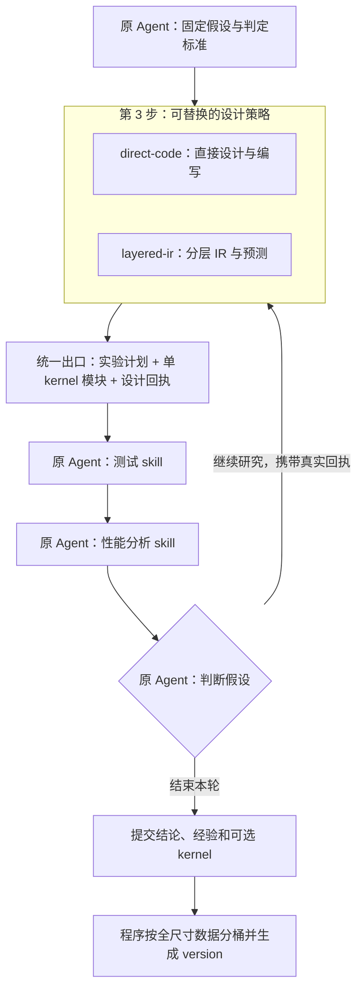
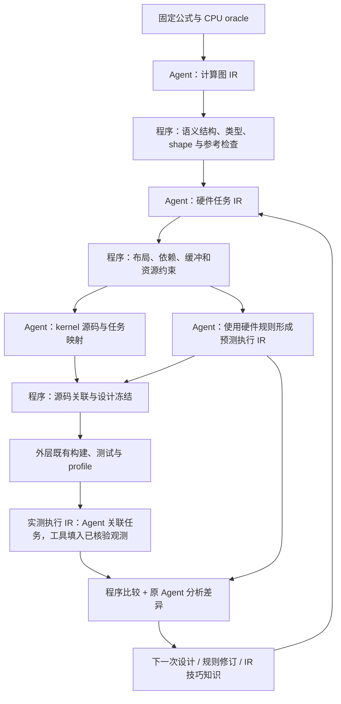

# 可替换的 kernel 实验设计步骤：分层 IR MVP

状态：设计提案，尚未实现。本文的新配置、工具、类型和目录均为拟议接口。

## 1. 本次设计的边界

把研究循环中第 3 步“设计实验并编写 kernel”定义为一个可替换的**设计策略**。首个新策略实现用户手绘图中的分层 IR、逐层约束、硬件执行预测和实测校准；原来的直接编写方式保留为另一种实现。外层研究循环只依赖统一输入输出。



**策略是同一个 Agent 使用的一组方法和校验器。** 加载策略、逐层修改 IR、修正 kernel、读取实验反馈均发生在原研究会话中。MVP 沿用一份 persona、两个测试/分析 skill；策略说明是可加载的参考材料，不为每层增加 prompt 或 Agent。

预测与实测的闭环通过已有步骤 4、5 返回的回执连接：策略读取历史证据，生成比较与下一轮设计。策略接口本身不隐藏启动 SSH、测试、profile 或集成的动作。Agent 仍选择何时调用原有工具。

## 2. 从用户设计保留的语义

| 用户设计 | MVP 中的表达 |
| --- | --- |
| Hardware → Ops → Case | 需求与知识的作用域索引：硬件目标、算子契约、固定 suite/case；原始文件可被多个作用域引用 |
| 公式定义与 CPU 精确结果 | 固定算子语义和独立 CPU oracle；任何策略都引用同一份，不按候选的输出修改标准 |
| 计算图 IR → 硬件任务 IR | Agent 分步描述算子数据流、分块、数据布局、执行资源、搬运、同步和缓冲生命周期 |
| 预测编译 → 执行 IR | Agent 使用硬件共享的版本化规则，生成执行关系与开销预测 |
| 实际执行 → 执行 IR → 对照修正 | 把真实回执关联到对应任务/区段，比较可比的预测项与观测项，提出规则修订 |
| 知识分为预测编译规则与 IR 编写技巧 | 结构化、可查询、可版本化的两类知识；保留证据、反例和适用域 |
| Agent 编写 IR，程序实现约束 | Agent 负责转换和解释；程序逐层校验并返回具体诊断，编译器/runner 提供真实构建与运行事实 |
| 一个算子拥有多个 kernel | 每个提交 kernel 分别完成全尺寸测试；周期末根据真实数据装配路由 version |

当前工程只支持 `qmq-v1` / int8，且 suite 不接受同 shape 的不同 dtype/layout。MVP 先在这个现有契约上完成替换。作用域类型预留 operator/dtype/layout，**不在本次顺带实现多算子或多 dtype 集成**。

“CPU 精确结果”指按固定算子契约定义的参考结果。整数累加、浮点舍入、溢出与容差各自按该契约处理；不能笼统承诺所有浮点变换逐位等价。

## 3. 可插拔边界与稳定契约

### 3.1 三层职责

| 层 | 负责的内容 | 替换时的影响 |
| --- | --- | --- |
| 研究外壳 | 同一 session、假设、预算、suite、材料、构建/测试/profile、交付与自动集成 | 不理解具体 IR 节点或预测算法 |
| 设计策略 | 实验方法、Agent 编写步骤、内部 IR、策略专属校验、预测与比较 | 可替换整个策略，输出仍符合公共契约 |
| 硬件预测器 | 某硬件目标的资源/指令模型、预测规则集合与证据解释规则 | 在 `layered-ir` 内独立替换；不修改计算图或公共 kernel ABI |

MVP 提供 `direct-code@1` 与 `layered-ir@1`。二者都是本插件内部注册的策略包；不另建 DSH 插件系统或独立服务。新增策略只需实现策略契约、注册 ID，并通过同一套契约验收。

### 3.2 输入和输出

以下是设计类型，不是当前已存在的 TypeScript API：

```ts
type Ref = string; // 宿主验证来源的文件或内容寻址引用

interface DesignContext {
  research_id: string;          // 宿主绑定，Agent 不能另换身份
  experiment_id: string;
  hypothesis_revision_ref: Ref;
  operator_contract_ref: Ref;
  oracle_ref: Ref;
  case_suite_ref: Ref;
  hardware_report_ref: Ref;
  initial_material_refs: Ref[]; // 启发材料，仍允许阅读其他文件
  prior_evidence_refs: Ref[];   // 原有 build/test/profile/analysis 回执
  budget_ref: Ref;             // 复用整轮预算，不另开无限预算
}

interface DesignResult {
  design_ref: Ref;             // 工具冻结的身份、版本、校验及产物哈希
  experiment_plan_ref: Ref;    // 对照、干预、预测、采样及判定规则
  candidates: Array<{
    kernel_path: string;       // 现有 kernel.json 所在目录
    role: "control" | "intervention" | "ablation";
    validation_ref: Ref;
  }>;
  internal_artifact_refs: Ref[]; // 外层保存引用，不解释其私有 schema
}
```

`DesignResult` 只在产物已准备好时返回，至少包含一个候选。中间的 `NEEDS_REVISION`、`BLOCKED` 返回诊断及已保存草稿，不冒充完成，也不强制结束研究。研究仍可因证据或预算限制以零提交 kernel 收尾。

公共候选出口继续是现有 `KernelModule`：`kernel_id/revision`、ABI、`symbol_prefix`、launcher、device/host 源码、依赖、`supported_case_ids`、硬件作用域与资源限制。公共出口不包含 version、shape 分桶或“已验证最优区间”。

冻结设计时，工具保存候选内容哈希及策略/预测器/规则版本。构建入口核对设计产物与待构建源码相符，再按现有逻辑生成 `source_hash`、构建和测试身份。`READY` 只表示设计侧已完成所要求的检查；真实构建、正确性与性能以之后的回执为准。

### 3.3 配置与同会话调用

拟议配置：

```json
{
  "design": {
    "strategy": "layered-ir@1",
    "options": { "predictor": "hardware-default" }
  }
}
```

`meteor_start` 可带同结构的本轮覆盖项；省略时读取项目配置。宿主解析注册的版本并固定代码、说明、schema、校验器和规则引用的哈希，写入 manifest 与启动包。旧工程缺少配置时走 `direct-code@1`，明确报告实际选择；未知 ID、版本或不兼容选项直接报配置错误。新模板在 `layered-ir` 真机验收通过后再默认启用它。

新增一个公共工具入口 `meteor_design`，不按 IR 层增加一批独立工具：

| action | 行为 |
| --- | --- |
| `open` | 绑定 experiment 与策略，返回本策略说明、阶段列表、草稿位置与固定上下文引用 |
| `check` | 校验指定阶段的草稿与父产物哈希，返回结构化诊断及检查覆盖范围 |
| `freeze` | 检查所需阶段与候选对应关系，生成不可变 `DesignResult`；不构建、不测量 |
| `compare` | 读取指定预测和既有真实回执，验证映射后生成比较产物；不启动采集、不判定研究假设 |

每个 action 的必填字段由明确的输入 union 校验；研究/session 身份由宿主注入。工具 dispatch 到所选策略，`direct-code` 的 stages 可以只有实验计划与候选模块。`compare` 不适用时显式返回 `NOT_APPLICABLE`。

策略包提供 `describeStages / validateStage / freezeArtifacts / compareEvidence` 四个内部接口。它们运行确定性文件校验和证据处理；LLM 编写过程由原 Agent 根据 `guide.md` 执行，不在接口内部新建 Agent。策略代码随可信项目模板固定，Agent 草稿中的字符串不能指定可执行模块或 shell 命令。

一轮 research 默认固定一个策略。确需更换时，通过显式新 design attempt 选择本轮快照内已登记的策略版本、保留理由和旧产物，session 保持不变；新安装的版本供后续 research 使用。不能因校验失败静默切换以绕过检查。构建产物精确绑定其自己的设计回执。

## 4. `layered-ir` 内部如何工作



每步失败都返回原 Agent 修改；后续产物记录父产物哈希。父 IR、源码、编译参数或规则发生变化，相应下游检查标为过期，不沿用旧的通过状态。

### 4.1 最小 IR 内容

| 产物 | 最少表达什么 | MVP 校验到什么程度 |
| --- | --- | --- |
| `semantic.json` | 固定公式/契约引用、oracle、输入输出 dtype/layout、数值语义 | 引用身份与既有算子一致；策略不得替换 oracle |
| `graph.json` | tensor、shape、算子节点、数据依赖、归约轴、常量和舍入点 | ID/类型/shape、定义与使用、数据依赖、已实现的算子约束；对支持的 qmq primitive 做有界 CPU 参考检查 |
| `tasks.json` | tile、数据所有权、core/pipe/存储域、搬运、计算、同步、缓冲槽和生命周期、尾块处理 | 固定 case 上的静态边界、覆盖/重叠声明、资源容量、同步配对与复用顺序 |
| `execution.predicted.json` | 任务实例/循环、串并行关系、资源占用、逻辑工作量、预测区间或符号式、规则与前提 | 依赖/单位一致、规则适用域、估计来源、资源与映射约束；保留未知量 |
| kernel + `mapping.json` | 实际模块；图/任务 ID 到源文件区段的关联 | ABI、ID、源哈希及映射存在；不能仅凭标签断言编译后真实执行关系 |
| `execution.observed.json` | 同条件下可观察的事件、时间、计数、观测范围和来源 | 工具从原始回执取值；校验 build/case/设备/协议/映射，不接受 Agent 自填数值作为实测 |

首版只为 qmq 所需的有界节点与转换提供检查，不实现通用 C++ 解析器、任意数学证明器或完整指令级模拟器。图变换由 Agent 编写；Ascend C 到机器指令仍交给真实工具链。反汇编、PC/源码映射存在时作为构建证据接入，不要求 Agent 手写机器码。

### 4.2 串并行约束必须可检查

沿用[结构化性能注释设计](2026-09-24-structured-performance-annotations.md)中的关系：发起顺序、完成依赖、跨迭代依赖、buffer 复用与资源互斥分别表示。

例如双缓冲至少表达：`load[t] → compute[t]` 的完成依赖、累加器跨 K tile 的依赖、同槽 `compute[t] → load[t+2]` 的复用约束。声明 double buffer 不等于观察到实际 overlap；不存在一条声明依赖也不等于已经证明并行。

每份检查报告给出 `rule_id`、产物 JSON pointer/源码位置、`PASS/FAIL/UNKNOWN/NOT_APPLICABLE`、期望/实际值、依据和受影响下游。缺少硬件容量、违反必要的生命周期等硬约束不能被 `UNKNOWN` 放行；缺少区段时长等性能观测能力可以继续实验，但相应预测与结论保持未验证。schema 通过、有限输入通过与全域语义证明是不同的检查覆盖级别。

### 4.3 预测与实测如何对齐

预测执行 IR 和实测执行 IR 使用共同的 target/metric 定义，分别保存为不可变 revision。一个可比较项至少匹配：

```text
kernel/source/build identity + case/input identity
hardware/toolchain identity + measurement protocol
target task/region/instance + metric definition + unit + observation scope
```

每个值带 `origin = model | static_derivation | hardware | simulator`、前提、采集方式和原始证据引用。源码区段映射为多对多或不存在时，明确记录歧义，不能强行对齐。

MVP 接现有 `kernel_time_us` / `device_task_time_us` 和静态任务结构；区域/pipe/指令粒度数据只有在实际 adapter 与硬件能力都支持时接入。只有整个 kernel 的总耗时时，实测执行 IR 只有该级别的观测。不能按源码比例拆成各阶段时间，也不能用预测填实测空缺。

Agent 可组织任务到观测的关联、解释差异和提出新规则；程序核对引用并回填观测值。比较输出逐项的 `MATCH / MISMATCH / NOT_COMPARABLE / UNOBSERVED`，匹配规则在测量前固定。模型拟合改善可作为规则进展，不能自动变成“机制已证明”或研究假设 `SUPPORTED`。

规则在看到本次结果后修订，必须生成新 revision，并把这批样本标为 calibration。要报告预测泛化改进，使用预先留出的 case 或之后的新实验验证，不能把回拟同一批数据当作独立证明。

## 5. 硬件共享预测器与结构化经验库

每种兼容硬件目标共享一个预测器入口，其规则可供多个算子复用。硬件目标依据真实报告定义：backend、SoC/架构、相关能力；影响规则的工具链版本与运行条件放入兼容约束。不是每个 kernel 或 research 各养一个与其他研究隔绝的预测器。

共享的是版本化方法与规则集合。每个研究固定实际使用的 predictor/rule revisions；并行研究可以提交不同修订与反例，通过内容身份和事务追加，不原地覆盖其他研究正在使用的版本。同一 Agent 可明确采纳新规则进入下一次设计，并保留此前预测。

沿用现有 SQLite + 内容寻址 artifact 库，按两类知识建立可查询索引：

| 类别 | 核心字段 | 典型内容 |
| --- | --- | --- |
| `prediction_rule` | rule/revision、hardware key、适用条件、预测关系/参数/单位、来源、校准证据、独立验证证据、反例、状态 | 某数据搬运在特定尺寸/对齐下的开销关系；某同步约束使两个阶段不能重叠 |
| `ir_technique` | technique/revision、输入/输出 IR 层、前提、不变量、适用 operator/case 域、正反实验引用 | 分块、layout 调整、double buffer、归约拆分及其必要条件 |

当前 `KnowledgeUpdate.kind` 的 `observation/mechanism/hypothesis/counterexample` 是认识状态分类，应保留。新增可选 `design_knowledge` 结构引用，上述两类作为正交分类，并包含 `scope_ref` 与 `revision_ref`。需要同步扩展 TypeScript 类型、严格提交 schema、SQLite migration、store/query 和材料读取；不能只往现有 JSON 填未知字段。

拟增 `design_knowledge_revisions` 索引表：`claim_id, revision, class, hardware_key, operator_abi?, suite_ref?, scope_ref, artifact_ref, parent_revision?`；详细规则与证据关系仍使用内容寻址 artifact 和现有 evidence links。相同 artifact/revision 重复导入幂等，新鲜度只由新的可追溯进展更新。

hardware → operator → case 是作用域关系，不把所有知识强制塞成树：硬件规则可以适用于多个算子，IR 技巧可以跨硬件，单次实验仍引用精确 case 集。Agent 的初始材料只是起点，仍可读取其他 kernel、知识与官方资料。

## 6. 文件布局与现有代码接缝

### 6.1 模板与扩展目录

```text
templates/project/tools/meteor/design/
  contracts.ts                 # 公共 DesignContext/Result/诊断
  registry.ts                  # 两个策略及硬件预测器的注册
  service.ts                   # open/check/freeze/compare；宿主绑定身份
  strategies/
    direct-code/               # manifest、guide、plan/module 校验
    layered-ir/                # manifest、guide、IR schema、分层校验与比较
  predictors/
    ascend/                    # 真实设备能力适配、预测规则解释约束

templates/project/knowledge/migrations/
  <next>-design-knowledge.sql
```

该目录位于已经冻结的 `tools/meteor` 下，策略说明和实现随研究快照固定。只保留一个 `layered-ir/guide.md` 说明分步方法，校验器负责不同阶段的具体错误，不把修复指导散成多个 Agent 提示词。

### 6.2 一次设计与实验的产物

```text
reports/meteor/<backend>/research/<research_id>/
  drafts/designs/<design_id>/
    semantic.json / graph.json / tasks.json
    execution.predicted.json / mapping.json
    rule-proposals.json
  drafts/<kernel_id>/<revision>/
    kernel.json / device.asc / host.asc
  experiments/<experiment_id>/
    plan.json / analysis.json
    builds/ / full-tests/ / profiles/     # 现有工具产物
    designs/<design_id>/                 # 新工具专属、Agent 不直接写
      manifest.json / validation.json
      frozen/                           # 所引用设计产物的不可变副本
      comparisons/<comparison_id>/
        execution.observed.json / comparison.json
        annotated/                      # 可选源码证据视图
```

草稿放在现有 `drafts/**` 写入范围。`experiments/.../designs` 由新工具写，不扩大 Agent 对原始回执或快照的写权限；冻结内容进入现有内容寻址 artifact 机制。

| 现有接点 | 最小修改 |
| --- | --- |
| `prompts/meteor.md` 自主实验循环第 3、4 项 | 改为按选中策略设计与编写；测试、分析、假设判定仍用原上下文 |
| `contracts.ts`、配置加载、`meteor_start` schema | 增加可选 design 选择，兼容旧工程，固定选择及版本/哈希 |
| `research.ts`、`host.ts` 启动包 | 记录策略、预测器与规则引用；复用已有快照目录 |
| `src/research-tools.ts` 与 `src/project.ts` | 注册一个 `meteor_design` 调度工具并加载 runtime 模块；沿用研究身份与写入边界 |
| `meteor_kernel_build` / `kernel-build.ts` | 增加可选 `design_ref`；启用设计契约的研究须引用有效设计回执，核对精确候选内容；ABI 不变 |
| 两个已有 skill | 说明设计回执、预测引用和真实证据如何往返；不增加测试方式或自动执行流程 |
| 提交类型/schema、store/query、migration | 记录可选设计/比较引用和两类结构化知识；沿用原事务与新鲜度逻辑 |

证据回填沿用已有注释提案：`layered-ir` 以任务 IR 为设计事实源，源码标识关联任务，生成的注释视图展示预测与真实证据。避免手工维护两份开销模型。给已测 `device.asc` 添加注释也会改变 source hash；因此只生成单独阅读视图，不修改已测源码。

## 7. MVP 的实施顺序和验收

1. **先抽出公共接缝。** 用 `direct-code@1` 走统一接口，验证相同候选仍可通过原 build/test/profile/submission；旧工程加载成功。此时不改变研究策略本身。
2. **接入分层 IR 策略。** 对 qmq 提供最小 graph/task/execution schema、逐层诊断、CPU 有界参考校验及精确候选冻结。Agent 收到错误后在原会话修订。
3. **接入预测与证据闭环。** 一个 Ascend 硬件预测器入口，真实回执到执行 IR 的关联，整 kernel 指标对照与未知项报告；修订进入结构化知识库。
4. **运行一次真实研究。** 同一 subagent 至少完成一次“分层设计 → 构建 → 测试/profile → 比较 → 修订”，每个提交 revision 全尺寸测试完整，由已有提交程序自动集成。

关键验收不是 JSON 文件数量，而是：

- 在同一个研究外壳中切换 `direct-code` / `layered-ir`，外层 build/test/profile 和 kernel ABI 不需要策略专用分支。
- 非法 shape/依赖、buffer 过早复用、超出已知容量、父产物变更、候选源码与设计不一致时，能拒绝并给出明确诊断。
- 缺少区域观测时保持 `UNOBSERVED`；模拟、静态推导、硬件观测不混用；历史证据不能绑定到新源码。
- 一个真实任务完成预测—实测对照及规则修订；原 session ID 连续，测试仍由 Agent 主动调用，未绕过设备队列。
- 并行研究的规则修订可并存；重复导入不刷新新鲜度；失败预测和反例可以入库。
- 无论假设成立与否，所有拟提交 kernel 都通过原有单 kernel 全尺寸交付门槛；路由与 version 只消费真实全尺寸成绩。

## 8. 决策记录与依据

| 决策 | 选择与代价 | 备选方案 |
| --- | --- | --- |
| 抽出第 3 步的策略包 | 替换范围可控；需要少量公共契约和 provenance 接入 | 只替换提示词无法执行逐层约束；重写全研究流程增加耦合 |
| Agent 转换、程序校验 | 符合用户设计，能逐步扩充规则；检查能力必须明确 | 全自动编译器投入过大，单靠自然语言检查不可可靠验收 |
| 测量通过公共回执反馈 | 设计策略可替换、执行队列与证据门槛复用；需维护观测映射 | 在策略内部自动跑实验会把原 Agent 的测试控制隐藏掉 |
| 硬件预测器与策略分离 | 同硬件知识可复用，规则变化不重做研究外壳；要管理兼容版本 | 每个 kernel 私有预测器难以累计知识，单一无版本全局文件难以追溯 |

### 成熟实现借鉴

- **NVIDIA CuTe / CUTLASS 4.4.2**：[Tensor 与 Thread-Value partitioning](https://docs.nvidia.com/cutlass/4.4.2/media/docs/cpp/cute/03_tensor.html#thread-value-partitioning)。概念借鉴：把逻辑 layout 和执行者到元素的映射分开。合法映射不能替代数值等价或真实性能验证。
- **Ascend C / CANN 8.3.RC1**：[TQueSync](https://www.hiascend.com/document/detail/zh/canncommercial/83RC1/API/ascendcopapi/atlasascendc_api_07_0180.html)。概念借鉴：显式源/目标 pipe 与同步依赖；具体可用接口仍以当前真实设备和工具链为准。
- **Ascend / CANN 社区版 8.5.0**：[源码热点、PC 与 Pipe 映射](https://www.hiascend.com/doc_center/source/en/CANNCommunityEdition/850/devaids/optool/atlasopdev_16_0088.html)。借鉴源码—指令—观测关联。该版本文档区分 hardware 与 simulator：不能把 simulator 的源码/指令 cycles 或模拟 L2 指标记为真机实测。当前工程 CANN 版本不同，先依实际报告检查能力。
- **MLIR 官方文档，2026-09-25 核对**：[分层 verifier](https://mlir.llvm.org/docs/DefiningDialects/Operations/#custom-verifier-code)、[Transform dialect](https://mlir.llvm.org/docs/Dialects/Transform/)。概念借鉴：转换产物与转换动作分离，分层校验并返回可修订的失败。MVP 不引入 MLIR 依赖，也不把 schema 合法等同语义证明。

本提案不复制上述项目源码；若实现阶段复制或适配代码，需要记录精确源文件/commit 和许可证。

**人类设计：** 只替换实验设计/编写 kernel 这一步；Hardware/Ops/Case 层次；分层 IR、硬件共享预测、预测/实测校准、两类结构化知识、Agent 转换与程序约束，以及已有单会话/全尺寸/周期末集成要求。

**Agent 补充设计：** strategy/predictor 两个替换边界、公共输入输出、单工具四种 action、版本/hash 冻结、草稿与不可变回执布局、兼容旧工程、MVP 范围与分阶段验收。上述选择仍可在实现前修改。

**验证状态：** 已对照现有 persona、构建 ABI、快照、写入范围、提交 schema、知识库和集成入口核查设计接缝；未实现或声称已完成 IR 真机研究验收。
