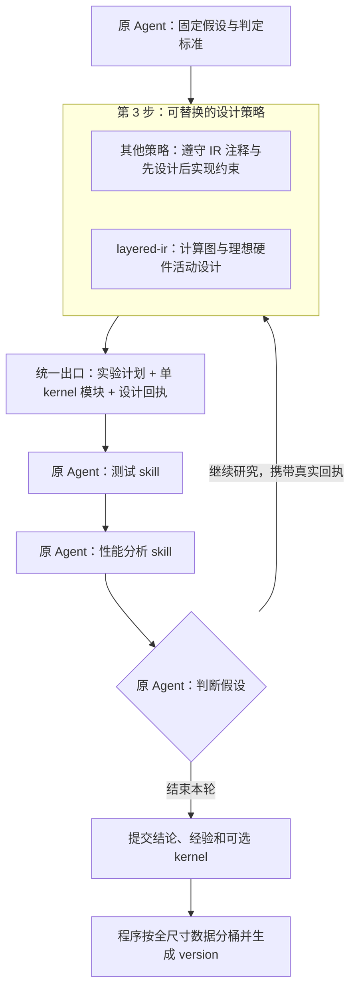
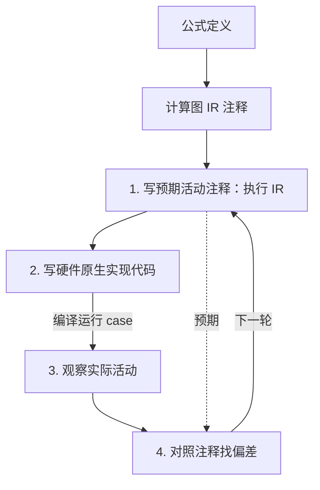

# 可替换的 kernel 实验设计步骤与 IR 层级

状态：2026-09-26 已实施注释循环 MVP 与可替换策略入口；完整语义证明和全部硬件活动自动映射仍是设计目标。实际工具、注释语法与已检查范围见[编写指南](../../templates/project/tools/meteor/design/guide.md)，验收记录见[实施记录](2026-09-26-workspace-implementation.md)。

**主流程：先写预期活动注释 → 写实现代码 → 看实际活动 → 对照注释找出不符合预期的地方。** 执行 IR 就是这些预期硬件活动的结构化描述。计算图 IR 同样写在 kernel 源码注释中，负责表达公式语义；执行 IR 的计算语义必须符合计算图。根据对照结果改进下一轮活动设计、实现与 HW 共享规则。

第 4.1、4.2 节保留计算图原语和当前算子展开，第 4.3 节定义执行 IR 的硬件活动原语，第 4.4 节定义注释、编写顺序与检查要求。MVP 采用源码中的 `meteor-ir:v1` 注释与活动关联标记，具体语法以编写指南为准；此前撤回的独立 IR 文件格式不作为实现依据。

公共架构依据：[单 HW workspace 仓库级改造](2026-09-25-single-hardware-workspace-restructure.md)单独定义整个仓库的配置、目录、身份、存储与迁移。本设计只定义第 3 步的可替换策略，并消费该公共架构；仓库改造不依赖本策略上线。

## 1. 本次设计的边界

把研究循环中第 3 步“设计实验并编写 kernel”定义为一个可替换的**设计策略**。分层 IR 方法放在这一步内部；新编写和修订的候选先写两种 IR 注释，再编写实现。策略可以替换硬件活动的设计方法，外层研究循环通过统一输入输出接入。旧的直接编写方式仅保留为迁移与回归基线。



**策略是同一个 Agent 使用的一组方法和校验器。** 加载策略、修改设计、修正 kernel、读取实验反馈均发生在原研究会话中。MVP 沿用一份 persona、两个测试/分析 skill；策略说明作为参考材料加载到原上下文。

实验反馈通过已有步骤 4、5 返回的回执连接：策略读取历史证据，形成下一轮设计。策略接口本身不隐藏启动 SSH、测试、profile 或集成的动作。Agent 仍选择何时调用原有工具。

## 2. 从用户设计保留的语义

| 用户设计 | MVP 中的表达 |
| --- | --- |
| 一个 HW 一个 workspace | 仓库根绑定唯一真实硬件目标；不同 HW 使用独立仓库实例；多个 op/dtype 在同一实例内共享预测器、知识库与执行队列 |
| 产物种类 → op → dtype | 含 IR 注释的源码、IR 派生视图、case 集、实验、测量、版本和报告分别归类；shape 保留在 case、支持域和路由规则中 |
| 公式定义与 CPU 精确结果 | 固定算子语义和独立 CPU oracle；任何策略都引用同一份，不按候选的输出修改标准 |
| 公式定义 → 计算图 IR → 执行 IR → 硬件原生代码 | 同一 Agent 先设计希望硬件怎样工作，再用 Ascend C 等代码实现；程序逐层提供约束与反馈 |
| 计算图采用基础运算 DAG | 在 kernel 结构化注释中表达符合公式的完整数据依赖；计算节点降到第 4.1 节的基础操作 |
| 执行 IR 以硬件活动为主体 | 在 kernel 结构化注释中描述计算、搬运、存储、配置、同步、串并行与等待；其中的计算语义必须符合计算图 |
| 原生代码 → 编译 → 硬件指令 → case 实际执行 → 实测转述 | 检查实际执行是否实现了事前设计的活动，按 case/运行条件保存构建与测量对应关系 |
| 执行 IR 的生成与规则改进 | HW 共享规则帮助从计算图设计和评估理想硬件活动；用实测核对活动、实现及预测，改进后续设计与规则 |
| 预测编译规则与 IR 编写技巧 | 保留两类结构化知识及其共享关系，具体字段另行设计 |
| Agent 编写与转换，程序实现约束 | 同一个 Agent 分步完成，每步接收程序反馈 |
| 一个算子拥有多个 kernel | 每个提交 kernel 分别完成全尺寸测试；周期末根据真实数据装配路由 version |

当前源码只支持 `qmq-v1` / int8，且 suite 不接受同 shape 的不同 dtype/layout。这是待迁移的实现限制。新设计从配置、身份与目录开始容纳同一 HW 下多个 op/dtype，每组各自绑定算子契约、oracle 和 suite；`qmq-v1/int8` 作为首个真机接入组。新增算子的契约检查和 runner 适配按其契约实现，不能只增加目录就声称已支持。

“CPU 精确结果”指按固定算子契约定义的参考结果。整数累加、浮点舍入、溢出与容差各自按该契约处理；不能笼统承诺所有浮点变换逐位等价。

### 2.1 本步骤消费的公共仓库契约

宿主向策略传入唯一 HW workspace、当前 `op_id/dtype_id`、契约、oracle、suite 和环境引用。策略使用统一路径服务保存本组设计产物，不自行建立 HW 子仓库、私有 catalog 或 shape 目录。

全尺寸、候选身份、知识共享、版本通道和旧证据迁移均按[仓库级改造方案](2026-09-25-single-hardware-workspace-restructure.md)执行。不同 op/dtype 的材料可以启发设计；当前候选与其测试证据必须匹配宿主固定的目标组。

策略返回当前组的单 kernel 候选。后续程序仍用该组的真实全尺寸数据自动寻找 shape 优势区间并生成 version；设计策略不自行分桶或发布版本。

## 3. 可插拔边界与稳定契约

### 3.1 职责边界

| 层 | 负责的内容 | 替换时的影响 |
| --- | --- | --- |
| 研究外壳 | 同一 session、假设、预算、suite、材料、构建/测试/profile、交付与自动集成 | 通过公共契约消费候选和产物引用 |
| 设计策略 | 实验方法、Agent 编写步骤、内部产物及专属校验 | 整体可替换，输出继续符合公共契约 |
| 执行 IR 生成规则 | 根据计算图、HW 能力与运行条件生成和评估理想活动，指导原生实现，并依据实测核对改进 | 同一 HW 的各 op/dtype 共享，规则保留版本和证据 |

分层方法以 `layered-ir@1` 作为新候选入口，遵守第 4 节的两种 IR 注释与先设计后实现顺序。现已实现源码注释解析、基本类型/依赖/覆盖检查、事前冻结和回执对照；数值等价及任意硬件活动自动转述尚未实现。`direct-code@1` 仅表示旧候选兼容，不是新候选可选择的绕过入口；显式 mock fixture 保留协议测试兼容。替换策略在运行时注册 ID 并保留公共检查。

### 3.2 输入和输出

以下是设计类型，不是当前已存在的 TypeScript API：

```ts
type Ref = string; // 宿主验证来源的文件或内容寻址引用

interface DesignContext {
  workspace_ref: Ref;          // 唯一 HW 绑定与 workspace 身份
  target: { op_id: string; dtype_id: string };
  research_id: string;          // 宿主绑定，Agent 不能另换身份
  experiment_id: string;
  hypothesis_revision_ref: Ref;
  operator_contract_ref: Ref;
  oracle_ref: Ref;
  case_suite_ref: Ref;
  hardware_report_ref: Ref;
  initial_material_refs: Ref[]; // 启发材料，仍允许阅读其他文件
  prior_evidence_refs: Ref[];   // 原有 build/test/profile/analysis 回执
  budget_ref: Ref;             // 复用整轮预算，不另开无限预算
}

interface DesignResult {
  design_ref: Ref;             // 工具冻结的身份、版本、校验及产物哈希
  experiment_plan_ref: Ref;    // 对照、干预、预测、采样及判定规则
  candidates: Array<{
    kernel_path: string;       // 现有 kernel.json 所在目录
    role: "control" | "intervention" | "ablation";
    validation_ref: Ref;
  }>;
  internal_artifact_refs: Ref[]; // 外层保存引用，不解释其私有 schema
}
```

`DesignResult` 只在产物已准备好时返回，至少包含一个候选。中间的 `NEEDS_REVISION`、`BLOCKED` 返回诊断及已保存草稿，不冒充完成，也不强制结束研究。研究仍可因证据或预算限制以零提交 kernel 收尾。

公共候选的代码出口继续是现有 `KernelModule`：`kernel_id/revision`、ABI、`symbol_prefix`、launcher、device/host 源码、依赖、`supported_case_ids`、硬件作用域与资源限制。宿主为其附加固定的 workspace/op/dtype 身份，检查 ABI、case 与本组配置一致。公共出口不包含 version、shape 分桶或“已验证最优区间”。

冻结设计时，工具保存包含两种 IR 注释的候选内容哈希、事前设计检查回执、策略版本及其依赖引用。构建入口核对设计产物与待构建源码相符，再按现有逻辑生成 `source_hash`、构建和测试身份。`READY` 只表示设计侧已完成所要求的检查；真实构建、正确性与性能以之后的回执为准。

### 3.3 配置与同会话调用

拟议配置：

```json
{
  "design": {
    "strategy": "layered-ir@1",
    "options": {}
  }
}
```

`meteor_start` 可带同结构的本轮覆盖项；省略时读取项目配置。宿主解析注册的版本并固定代码、说明、校验器和依赖引用的哈希，写入 manifest 与启动包。新流程默认使用 `layered-ir@1`；旧工程的 `direct-code@1` 回执按兼容规则读取，不能因缺少配置而静默生成无 IR 注释的新候选。未知 ID、版本或不兼容选项直接报配置错误。这里是待实施的默认策略变更，仍须完成契约与真机验收。

新增一个公共工具入口 `meteor_design`：

| action | 行为 |
| --- | --- |
| `open` | 绑定 experiment 与策略，返回本策略说明、阶段列表、草稿位置与固定上下文引用 |
| `check` | 校验指定阶段的草稿与父产物哈希，返回结构化诊断及检查覆盖范围 |
| `freeze` | 检查所需阶段与候选对应关系，生成不可变 `DesignResult`；不构建、不测量 |
| `compare` | 读取本次设计和既有实验回执，按所选策略生成反馈；不启动采集、不判定研究假设 |

每个 action 的必填字段由明确的输入 union 校验；研究/session 身份由宿主注入。工具 dispatch 到所选策略。新候选的阶段必须覆盖计算图注释、事前执行 IR 注释以及随后完成的代码实现；事前阶段允许 kernel 文件只有注释和声明骨架。`compare` 不适用时显式返回 `NOT_APPLICABLE`。

策略包提供 `describeStages / validateStage / freezeArtifacts / compareEvidence` 四个内部接口。它们运行确定性文件校验和证据处理；LLM 编写过程由原 Agent 根据 `guide.md` 执行，不在接口内部新建 Agent。策略代码随可信项目模板固定，Agent 草稿中的字符串不能指定可执行模块或 shell 命令。

一轮 research 默认固定一个策略。确需更换时，通过显式新 design attempt 选择本轮快照内已登记的策略版本、保留理由和旧产物，session 保持不变；新安装的版本供后续 research 使用。不能因校验失败静默切换以绕过检查。构建产物精确绑定其自己的设计回执。

## 4. 层级、预期硬件活动与源码注释

**先写预期活动注释，再写实现代码，运行后观察实际活动，最后对照自己的注释找偏差。理想硬件活动是目标，硬件原生代码是实现手段。** 注释先说明希望硬件怎样计算、搬运、等待和并行；活动开销可以有预测和未知，不能把设计目标当作已经测得的事实。

计算图 IR 和执行 IR 都以 kernel 源码中的结构化注释表达。计算图必须符合公式定义；执行 IR 中的计算及数据流必须符合计算图，其主体是本 HW 上的活动、资源访问、依赖与执行关系。完整动作集合见第 4.3 节，编写与证据规则见第 4.4 节。



公式同时定义独立 CPU 参考结果；硬件原生代码经编译产生硬件指令，再运行 case。图中的执行 IR 是源码结构化注释中的事前设计，实际活动是用于核对它的观测。HW 共享规则帮助写出预期，偏差分析用于改进这些规则；调整实现时，先明确下一轮的活动预期。

- **生成规则：** 结合计算图、HW 能力、目标 case/支持域和运行条件，帮助 Agent 设计活动、估计开销并选择实现方式。代码和编译产物可用于检查实现偏差，不能代替事前活动设计。同一 HW 的各 op/dtype 共享规则，经验库仍保留“预测编译规则”和“IR 编写技巧”分类。
- **语义约束：** 公式规定要算什么；计算图完整表达其值与依赖；执行 IR 说明这些计算怎样由具体硬件活动完成。分块、融合、重排和并行都需保持契约规定的计算语义。
- **实测依据：** 不同 case/运行条件分别转述，关联测试时冻结的 IR 注释、精确构建、环境和原始测量。可测、推断和未知保持可区分；事后证据不覆盖事前设计。
- **规则迭代：** 编写实现前保存活动设计和规则版本，测量前再固定与实现匹配的候选快照。对照后形成下一版设计或规则，旧预测、旧实现和旧测量继续可追溯。
- **职责与边界：** 同一个研究 Agent 编写两种 IR、实现代码并分析反馈，程序提供约束。构建、运行和性能采集仍由原 Agent 调用测试/分析 skill；第 3 步准备设计产物。kernel 全尺寸表现、假设结论和周期末自动集成按已有契约处理。

### 4.1 计算图 IR v1：28 个计算原语

计算节点限定为下表的 **28 个标量原语**。每个节点产生一个带类型的值，边引用该值；同一个值可以被多个节点使用。图按[用户提供的 DAG](assets/quant_matmul_relu_quant_full_dag_npu_mapping.svg)组织，张量运算由这些节点及其重复结构组成。

类型记号：`I` 为 `i8/i16/i32/i64/u8/u16/u32/u64`；`S` 为其中的有符号整数；`F` 为 `f16/bf16/f32/f64`；`N = I | F`；`V = N | bool`。同一签名内重复的类型字母表示**完全相同的 dtype**。常量也有 dtype；除显式 `cast` 外没有隐式类型提升、混合精度或广播。类型集合表示 IR 的表达能力，具体 HW 支持由映射检查确定。

| 类别 | 原语 | 输入 → 输出 | 定义 |
| --- | --- | --- | --- |
| 算术 | `add`、`sub`、`mul` | `(N, N) → N` | 加、减、乘 |
| 浮点除法 | `div` | `(F, F) → F` | 浮点除法，在结果 dtype 舍入 |
| 整数除法 | `idiv` | `(I, I) → I` | 整数商向零截断：`idiv(-5, 2) = -2` |
| 整数余数 | `imod` | `(I, I) → I` | `a - idiv(a,b) * b`：`imod(-5, 2) = -1` |
| 二元极值 | `min`、`max` | `(N, N) → N` | 只比较两个值并产生较小/较大值 |
| 融合乘加 | `fma` | `(F, F, F) → F` | 计算 `a*b+c`，中间乘积不舍入，最终只舍入一次 |
| 相等比较 | `eq`、`ne` | `(V, V) → bool` | 相等、不等 |
| 大小比较 | `lt`、`le`、`gt`、`ge` | `(N, N) → bool` | 小于、小于等于、大于、大于等于 |
| 布尔逻辑 | `and`、`or` | `(bool, bool) → bool` | 逻辑与、逻辑或 |
| 布尔取反 | `not` | `bool → bool` | 逻辑非 |
| 位运算 | `bit_and`、`bit_or`、`bit_xor` | `(I, I) → I` | 按位与、或、异或 |
| 按位取反 | `bit_not` | `I → I` | 在本 dtype 位宽内逐位取反 |
| 左移 | `shl` | `(I, u32) → I` | 左移，低位补零，舍弃移出的高位 |
| 逻辑右移 | `lshr` | `(I, u32) → I` | 右移，高位补零 |
| 算术右移 | `ashr` | `(S, u32) → S` | 右移，高位填充原符号位 |
| 条件选值 | `select` | `(bool, V, V) → V` | `select(p,a,b)`：p 为真取 a，否则取 b |
| 数值转换 | `cast<dst>` | `N → dst`，`dst ∈ N` | 按下面的转换规则产生新 dtype 的数值 |
| 浮点取整 | `round<mode>` | `F → F` | 取整后仍为原浮点 dtype；mode 必须显式指定 |

**数值规则也是原语定义的一部分：**

1. **整数。** `add/sub/mul` 保留结果低 w 位，有符号类型按二补码解释；需要更大数域时先 `cast` 扩宽。`idiv/imod` 要求除数非零，排除有符号 `MIN / -1` 的溢出情形。比较与极值按 dtype 的有符号/无符号解释。移位量满足 `0 ≤ s < w`，不自动对位宽取模。
2. **浮点。** `add/sub/mul/div/fma` 的基准语义为结果 dtype 的 nearest-even 舍入，保留 subnormal；每个节点独立舍入。`add(mul(a,b),c)` 有两次舍入，`fma(a,b,c)` 只有一次。NaN/Inf 及浮点除零遵循 IEEE 浮点数值规则，例如非零有限数除以零得到相应符号的 Inf，`0/0` 得到 NaN；不承诺 NaN payload 或异常标志。浮点 `min/max` 遇任一 NaN 返回 NaN；对两种零，`min(-0,+0)=-0`、`max(-0,+0)=+0`。比较遇 NaN 时只有 `ne` 为真，其余比较为假。
3. **转换。** `I→I` 把原整数值对目标位宽取模，再按目标符号解释，覆盖扩宽、缩窄和符号改变。`I→F`、`F→F` 按目标格式 nearest-even 舍入；`F→I` 向零截断，并要求输入有限且截断后的整数在目标范围内。饱和转换通过 `min/max` 限幅后再 `cast` 表达。
4. **取整。** mode 为 `rne`（最近，恰好一半取偶数）、`rtz`（向零）、`floor`（向负无穷）、`ceil`（向正无穷）。例如 `round<rne>(2.5)=2.0`、`round<rne>(3.5)=4.0`；它不负责改变 dtype 或限幅。NaN 返回 NaN，Inf 保持其符号；结果为零时保留输入符号。
5. **选值。** `select` 消费已经定义的两个值，没有短路含义，不能用它掩盖另一输入子图中的非法整数除法、越界索引或转换。需要避免非法除数时先选出安全除数，再做除法。

**复合表达的固定展开：** `relu(x) = max(x, 0)`；`clip(x,l,h) = min(max(x,l),h)`；整数 `floordiv(a,b)` 可由 `idiv/imod`、符号比较和 `select` 在非整除且异号时把商减一。常量、输入元素引用、输出绑定、索引范围和重复子图属于图结构；`matmul`、`reduce_sum`、`reduce_max` 等阅读分组必须能展开到表中原语。v1 不设任意外部 `call` 逃逸口；新增基础运算须在后续原语版本中补齐签名、数值规则和参考求值。

**借鉴范围：** 算术、比较、逻辑、选值及转换的划分参考 [TVM v0.26.0 的表达式节点](https://github.com/apache/tvm/blob/v0.26.0/include/tvm/tirx/expr.h)；位运算、取整和 FMA 的参考入口为其 [tirx/op.py](https://github.com/apache/tvm/blob/v0.26.0/python/tvm/tirx/op.py)。上表是 Meteor 自行选定的集合与命名，数值规则也由本节明确规定。HW 映射可使用一条指令或指令组合；近似除法、FTZ 或融合与上述基准有差异时，须记录差异、核对算子契约的容许范围并验证，不能静默改写原语含义。

### 4.2 用原语完整表达 quant_matmul_relu_quant

下面是计算图的文本表达。`m/n/k` 为索引重复的记号，不指定串行或并行调度；每条赋值定义一个值及其依赖。所有 `0/1/127/-128` 均显式标成 `f32`。本例使用的计算原语只有 **9 个：`cast, mul, add, max, min, div, gt, select, round`**。

```text
# 每个 (m,n,k) 的乘积；先扩宽，避免在 i8 内乘法溢出
lhs[m,k] = cast<i32>(x1[m,k])
rhs[n,k] = cast<i32>(x2[n,k])
p[m,n,k] = mul(lhs[m,k], rhs[n,k])

# K 个 i32 乘积接成 add 树
acc[m,n] = tree(add, p[m,n,0:K])

# 每一次乘 scale 都产生独立的 f32 结果
v0[m,n] = cast<f32>(acc[m,n])
v1[m,n] = mul(v0[m,n], x1Scale[m])
v2[m,n] = mul(v1[m,n], x2Scale[n])
a[m,n]  = max(v2[m,n], f32(0))

# 同一行的 N 个激活值接成 max 树
row[m]    = tree(max, a[m,0:N])
scaled[m] = div(row[m], f32(127))
active[m] = gt(row[m], f32(0))
yScale[m] = select(active[m], scaled[m], f32(1))

# 复用原来的 a[m,n]；一行的 yScale[m] 被本行所有 n 引用
ratio[m,n]   = div(a[m,n], yScale[m])
rounded[m,n] = round<rne>(ratio[m,n])
lower[m,n]   = max(rounded[m,n], f32(-128))
clamped[m,n] = min(lower[m,n], f32(127))
y[m,n]       = cast<i8>(clamped[m,n])
```

`tree` 是**展开记法**：长度为 1 时直接引用该值；长度大于 1 时在 `floor(length/2)` 处分成前后两段，分别展开，再由一个指定的二元原语连接。长度须大于 0。因此 `tree(add,[p0,p1,p2,p3])` 精确展开为 `add(add(p0,p1),add(p2,p3))`，每条依赖都有确定来源。保存时可以共享这一重复定义，查看时展开某个元素或 tile；逻辑图始终明确。对浮点加法，更换归约树会改变舍入顺序，属于数值变换；本例的整数加法树和有限非负数的 max 树不引入该问题。

这份展开采用当前 [qmq-v1 契约](../../templates/project/contracts/qmq-v1/int8/operator.json)和 [CPU oracle](../../templates/project/tools/meteor/runners/remote/gen_case.py)：整数结果须在 i32 范围内；依次执行 `cast<f32> → ×x1Scale → ×x2Scale → max(0)`；激活须有限，输出 scale 须有限且大于零；量化采用 nearest-even。全零行经 `select` 得到 `yScale=1` 和全零输出。激活溢出或正行最大值除以 127 后下溢为零时，沿用 oracle 的报错行为，不自行添加 epsilon。附件的 `×s2 → ReLU → ×s1` 仅沿用图形组织，其运算顺序不替换现有契约。

**由程序执行的计算图检查：**

- 节点名属于 28 个原语；参数数量、dtype、`cast` 目标和 `round` mode 符合 4.1；每个值只有一个定义，依赖无环，索引在声明范围内。
- 所有输出都有完整来源；重复子图和归约树可展开；广播表现为多条边引用同一值。当前图中的 `a` 同时供行最大值与量化使用，不能丢失任一分支。
- 检查整数除法、移位、转换等定义域，以及固定算子的溢出/有限性条件；无法静态证明时报告具体缺口，再用契约约束及测试核查，不能把有限测试写成全域证明。
- 按这些原语独立求值，与固定 CPU oracle 比较。至少覆盖负累加经过 ReLU、全零行、K/N 为 1 或奇数、nearest-even 的半整数，以及分阶段 FP32 舍入。

Agent 先把该计算图写入 kernel 的结构化注释，再设计符合其计算语义的执行 IR 注释，包括硬件计算方式、分块、存储、搬运、同步和可重叠关系。程序检查事前设计后，Agent 编写 Ascend C 等代码实现这些活动。真实编译与 case 测量用于核对实现和活动设计；性能以真实测量评价。

### 4.3 执行 IR 原语：硬件活动目录

执行 IR 的原语描述目标硬件上发生的活动：计算、数据访问与搬运、随路处理、配置、同步、缓存、指令调度、等待和互联。每项活动可以包含“怎样计算”的内容，例如 Cube 乘加的输入、累加方式和输出，以及 Fixpipe 随路量化的数值语义；它们必须能够对应到计算图的计算与数据依赖。

以下是 **A3 / dav-2201 的首批原语目录**，以开发机 CANN 9.0 和官方 A3 支持范围为基础。它是公开可确认的活动集合，不宣称穷举未公开 ISA。其他 HW 使用本身的能力目录；即使名称相同，也需核对路径、dtype、数值模式和同步范围。表中 API 用于追溯实现，一次调用可能展开多个活动，一个活动也可能同时完成搬运与计算。

目录中的配置有时是独立寄存器操作，有时编码在指令参数中；等待是执行状态，利用率、带宽和周期是证据。程序应保留这种区别，避免把每个 API、参数和统计字段都机械变成一条执行指令。Vector 对 UB、Cube 对 L0 的隐含访问可展开为子活动，但不能重复计算开销。

#### 4.3.1 Vector 计算

| 活动原语 | 具体操作与对应 API |
| --- | --- |
| 加、减、乘、除 | `Add`、`Sub`、`Mul`、`Div` |
| 最小值、最大值 | `Min`、`Max` |
| 向量与标量计算 | `Adds`、`Muls`、`Mins`、`Maxs`；仍属于 Vector 活动 |
| 绝对值 | `Abs` |
| 指数、自然对数 | `Exp`、`Ln` |
| 倒数、平方根、平方根倒数 | `Reciprocal`、`Sqrt`、`Rsqrt` |
| 分段激活 | `Relu`、`LeakyRelu` |
| 按位逻辑 | `Not`、`And`、`Or` |
| 位移 | `ShiftLeft`、`ShiftRight` |
| 乘加、乘加并激活 | `Axpy`、`MulAddDst`、`FusedMulAdd`、`FusedMulAddRelu` |
| 算术与转换组合 | `MulCast`、`AddReluCast`、`SubReluCast` |
| 加减并激活 | `AddRelu`、`SubRelu` |
| 量化或反量化相关计算 | `CastDeq`、`AddDeqRelu` |
| 比较 | 相等、不等、大于、小于等；`Compare`、`CompareScalar` |
| 条件选择、掩码过滤 | `Select`、`GatherMask` |
| 数据类型转换 | `Cast`，保留具体舍入与饱和方式 |
| 整个 repeat 内归约 | `WholeReduceSum/Max/Min` |
| DataBlock 内归约 | `BlockReduceSum/Max/Min` |
| 成对、跨 repeat 求和 | `PairReduceSum`、`RepeatReduceSum` |
| 固定块转置、布局重排 | `Transpose`、`TransDataTo5HD` |
| 常数填充、广播 | `Duplicate`、`Brcb` |
| 按索引收集元素或数据块 | `Gather`、`Gatherb` |
| 固定块排序 | `Sort32` |
| 合并有序序列 | `MrgSort` |

各操作的 dtype、长度和步长支持范围分别检查；复合 API 是否展开需要结合编译结果。观测上可获得 Vector 周期、UB 读写和冲突汇总，不能据此宣称已经测得每条运算的起止时间。[官方 A3 基础 API 支持表](https://www.hiascend.com/document/detail/en/canncommercial/850/opdevg/Ascendcopdevg/atlas_ascendc_10_00019.html)

#### 4.3.2 Cube 计算

| 活动原语 | 计算与访问语义 |
| --- | --- |
| 稠密矩阵乘 | `C = A × B`，结果写入 L0C |
| 矩阵乘并累加 | `C = A × B + C`，保留 L0C 中间结果 |
| 使用 Bias 初始化并计算 | 从 BiasTable 取得初值，再执行乘加 |
| 矩阵向量特例 | `Mmad` 的 GEMV 场景，具有专门布局约束 |
| 结构化稀疏矩阵乘加 | `MmadWithSparse`；A3 的特定 4:2 结构化稀疏，INT8 输入、INT32 输出 |
| 左、右操作数读取 | L0A / L0B → Cube |
| 初值、累加值读取 | BiasTable / L0C → Cube |
| 计算结果写入 | Cube → L0C |

操作数读取和结果写入是计算活动的组成部分，展开后与父计算共用相应开销归属。Cube 乘加可以实现计算图中一组乘法与归约节点，但需核对累加、溢出、舍入及融合语义。观测上可取得 Cube 指令分类、活动周期和部分 L0 访问统计。[Mmad](https://www.hiascend.com/document/detail/en/CANNCommunityEdition/910/API/ascendcopapi/docs/en/api/SIMD-API/basic_api/cube_compute_ISASI/mmad_compute/Mmad.md)、[MmadWithSparse](https://www.hiascend.com/doc_center/source/en/CANNCommunityEdition/900/API/ascendcopapi/atlasascendc_api_07_0250.html)

#### 4.3.3 Scalar 计算、控制和状态访问

| 活动原语 | 内容 |
| --- | --- |
| 标量算术 | 实际生成的加减乘除等操作 |
| 地址计算 | 基址加偏移、索引计算、步长推进 |
| 整数逻辑 | 按位运算、移位、条件比较 |
| 比特统计 | 0/1 计数、前导零计数、连续符号位计数 |
| 比特查找 | 首个指定值的比特，例如 `ScalarGetSFFValue` |
| 数值转换 | `ScalarCast`、整数与浮点或不同浮点类型转换 |
| 控制流 | 分支、循环、实际生成的跳转、调用与返回 |
| 标量读取、写入 | GM 或受支持局部存储上的 load/store |
| 系统状态读取 | block/sub-block ID、系统周期、程序计数器等 |
| 计算状态读取 | 比较掩码、归约结果状态、排序结果状态 |
| 控制寄存器读写 | 初始化或改变后续执行模式 |

编译期求值、被消除的表达式和纯类型操作不产生运行活动。观测上可取得 Scalar 活动、单/双发射及若干阻塞原因汇总。[GetSFFValue](https://www.hiascend.com/document/detail/zh/canncommercial/900/API/ascendcopapi/atlasascendc_api_07_0020.html)、[连续符号位计数](https://www.hiascend.com/document/detail/zh/CANNCommunityEdition/82RC1alpha003/API/ascendcopapi/atlasascendc_api_07_0035.html)

#### 4.3.4 数据搬运与填充

| 实际路径 | 活动原语 |
| --- | --- |
| GM → UB | 向量输入和参数搬入 |
| GM → L1 | 矩阵输入和参数搬入 |
| GM → L0A / L0B | 受支持 Load2D 路径装载矩阵操作数 |
| L1 → L0A | 左矩阵装载 |
| L1 → L0B | 右矩阵装载 |
| L1 → BiasTable | Bias 参数装载 |
| L1 → Fixpipe Buffer | 随路量化等参数装载 |
| L1 → 稀疏索引专用缓冲 | 稀疏计算索引装载 |
| UB → GM | 向量结果或中间结果搬出 |
| L1 → GM | L1 数据搬出 |
| L0C → GM | 矩阵结果搬出 |
| L0C → L1 | 矩阵结果转换后返回 L1，受 dtype 和量化模式限制 |
| UB → UB | 局部复制或重排，执行方式由具体接口及编译结果确定 |
| 常数 → UB / L1 / L0A / L0B | 填充、初始化，例如 `Duplicate`、`InitConstValue` |

通常 GM 搬入对应 MTE2，L1 → L0A/B 对应 MTE1，局部数据搬出对应 MTE3，L0C 结果处理与搬出对应 Fixpipe；不能仅凭同名 API 推断使用同一个执行单元。多条路径可测活动周期、流量或带宽，粒度依工具能力确定。[DataCopy 路径表](https://www.hiascend.com/doc_center/source/en/CANNCommunityEdition/900/API/ascendcopapi/atlasascendc_api_07_0103.html)、[装载路径与约束](https://www.hiascend.com/document/detail/en/CANNCommunityEdition/910/API/ascendcopapi/docs/en/api/SIMD-API/basic_api/cube_compute_ISASI/cube_compute_load/matrix_computation_input_movement_constraint.md)、[局部存储初始化](https://www.hiascend.com/document/detail/zh/CANNCommunityEdition/850/API/ascendcopapi/atlasascendc_api_07_0237.html)

#### 4.3.5 搬运时的随路处理

| 活动原语或搬运功能 | 内容 |
| --- | --- |
| 连续、跨步搬运 | 按块长度、块数、源目的步长访问 |
| 非对齐搬运 | 处理尾块及非整块长度 |
| 填充 | 补零或补指定数值 |
| 有效区域写出 | 排除矩阵计算产生的无效填充区域 |
| 输入布局转换 | 例如 GM → L1 时的 ND → NZ |
| 装载时转置 | `LoadDataWithTranspose` 等 |
| 卷积展开 | Load3D 的窗口选择、步幅、膨胀、padding、im2col |
| 稀疏权重和索引联合装载 | `LoadDataWithSparse` |
| 结果布局转换 | Fixpipe 搬出时的 NZ → ND 等受支持模式 |
| 结果类型转换 | 例如 FP32 → FP16 / BF16 |
| 标量参数量化 | 一段数据使用同一个量化参数 |
| Tensor 参数量化 | 从参数缓冲读取相应量化系数 |
| 随路激活 | Fixpipe 的 ReLU |
| 通道拆分、合并 | 按实际搬出模式与产品约束执行 |
| 图像预处理搬入 | AIPP 的填充、通道交换、色彩空间转换、类型转换、按参数归一化等 |

同一次活动包含多个功能时，保留组合语义及硬件限制，不强行拆成依次执行的独立流水。A3 的 L0C → L1 不具备 L0C → GM 的全部功能：相应路径的 NZ2ND 不生效，输出类型和量化模式也有限制。纯布局变化须保持逻辑元素对应，量化和激活须对应计算图中的计算。[Load3D](https://www.hiascend.com/document/detail/en/CANNCommunityEdition/910/API/ascendcopapi/docs/en/api/SIMD-API/basic_api/cube_compute_ISASI/cube_compute_load/Load3D.md)、[Fixpipe](https://www.hiascend.com/doc_center/source/en/CANNCommunityEdition/900/API/ascendcopapi/atlasascendc_api_07_0251.html)、[L0C → L1](https://www.hiascend.com/document/detail/en/CANNCommunityEdition/910/API/ascendcopapi/docs/en/api/SIMD-API/basic_api/cube_compute_ISASI/cube_compute_store/Fixpipe_L0CToL1.md)、[AIPP](https://www.hiascend.com/document/detail/en/CANNCommunityEdition/910/API/ascendcopapi/docs/en/api/SIMD-API/basic_api/cube_compute_ISASI/cube_load_aux_config/SetAippFunctions.md)

#### 4.3.6 执行模式配置

| 配置活动 | 影响 |
| --- | --- |
| Vector mask 设置、恢复 | 哪些元素参与计算 |
| Normal / Count mask 模式切换 | mask 的解释方式 |
| 比较寄存器设置、读取 | 后续条件选择的条件 |
| 重复次数与 block/repeat stride | 指令重复和地址生成；可能直接属于指令参数 |
| 向量量化参数设置 | 后续量化计算 |
| Cube 初值、Bias 来源设置 | 清零、累加或使用 Bias |
| Cube 行、列遍历顺序设置 | 矩阵结果生成顺序 |
| HF32 模式、转换模式设置 | FP32 输入的处理与精度 |
| Load3D 参数设置 | 窗口、边界、padding、重复等 |
| Fixpipe 格式、量化配置 | 后续结果搬出的转换 |
| 饱和及特殊值模式设置 | 溢出、Inf/NaN 等处理 |
| 原子模式设置、解除 | 普通覆盖或原子更新 |

只把实际产生的配置操作单独记录；指令参数保留在所属活动中。数值模式改变也受第 4.1 节和算子契约约束。[Vector mask](https://www.hiascend.com/doc_center/source/en/CANNCommunityEdition/900/API/ascendcopapi/atlasascendc_api_07_0096.html)、[HF32 模式](https://www.hiascend.com/doc_center/source/en/CANNCommunityEdition/900/API/ascendcopapi/atlasascendc_api_07_0258.html)、[Fixpipe 配置](https://www.hiascend.com/document/detail/en/CANNCommunityEdition/910/API/ascendcopapi/docs/en/api/SIMD-API/basic_api/cube_compute_ISASI/cube_store_aux_config/SetFixPipeConfig.md)

#### 4.3.7 同步、通知与原子更新

| 活动原语 | 语义 |
| --- | --- |
| 核内完成事件置位 | `SetFlag`，源流水前序活动完成后发出通知 |
| 核内事件等待 | `WaitFlag`，目标流水等待相应条件 |
| 单流水屏障 | 指定流水的顺序约束 |
| 核内全流水屏障 | `PipeBarrier<PIPE_ALL>` |
| 同类核同步通知 | 全部参与的 AIC 或 AIV 到达 |
| 同组两个 AIV 同步 | Vector 核间通知和等待 |
| AIC 与 AIV 协作同步 | Cube 与 Vector 核间通知和等待 |
| 跨核等待 | 等待指定同步条件满足 |
| 全核同步 | `SyncAll` 的实际软/硬实现 |
| Cube–Fixpipe 分形级协作 | `unitFlag`，部分结果完成后开始搬出 |
| 原子加 | 搬出数据时对 GM 目标累加 |
| 原子最小值、最大值更新 | 搬出数据时比较并更新目标 |
| 原子配置状态读写 | `Get/SetStoreAtomicConfig` 等 |

A3 的 CrossCore 模式为 0/1/2。`PipeBarrier<PIPE_S>` 不支持；Scalar 顺序不能通过调用该接口建立。通过 GM 实现的软件通知与轮询应展开为实际读写、比较、分支及同步。`SyncAll` 或框架队列 API 也不默认等于一条硬件指令。当前可取得部分等待汇总，但没有逐个同步事件真机起止时间的验证。[SetFlag/WaitFlag](https://www.hiascend.com/doc_center/source/en/CANNCommunityEdition/900/API/ascendcopapi/atlasascendc_api_07_0270.html)、[PipeBarrier](https://www.hiascend.com/doc_center/source/en/CANNCommunityEdition/900/API/ascendcopapi/atlasascendc_api_07_0271.html)、[CrossCore](https://www.hiascend.com/doc_center/source/en/CANNCommunityEdition/900/API/ascendcopapi/atlasascendc_api_07_0273.html)、[SyncAll](https://www.hiascend.com/doc_center/source/en/CANNCommunityEdition/900/API/ascendcopapi/atlasascendc_api_07_0204.html)、[DMA 原子加](https://www.hiascend.com/document/detail/en/CANNCommunityEdition/900/API/ascendcopapi/atlasascendc_api_07_0210.html)、[Store 原子配置](https://www.hiascend.com/doc_center/source/en/CANNCommunityEdition/900/API/ascendcopapi/atlasascendc_api_07_0286.html)

#### 4.3.8 缓存与存储系统

| 活动原语 | 内容 |
| --- | --- |
| 普通取指 | 从指令存储位置获取代码 |
| 指令预取 | `ICachePreLoad` |
| 指令预取状态读取 | `GetICachePreloadStatus` |
| 数据预取 | `DataCachePreload`，GM → DCache |
| DCache 单行回写并失效 | 指定缓存行 |
| DCache 全部回写并失效 | 当前核的整个 DCache |
| 缓存查找、命中返回 | ICache、DCache、L2 等相应访问 |
| 缓存未命中后的填充 | 从下一级取得数据 |
| 缓存写入、脏数据回写 | 行为受缓存策略影响 |
| L2 读写请求处理 | 为核外访存服务 |
| HBM 读取、写入 | 真正到达内存侧的事务 |
| 局部存储端口读写 | Cube、Vector、Scalar、搬运单元访问各缓冲 |

隐含的缓存展开需标明推断或观测来源。GM 是地址空间，一次 GM 访问可能命中缓存，不能据逻辑读取量直接断言 HBM 流量。可统计 ICache miss、L2 命中/未命中和 HBM 流量，但逐事务过程通常不能由这些汇总唯一恢复。[数据预取](https://www.hiascend.com/doc_center/source/en/canncommercial/850/API/ascendcopapi/atlasascendc_api_07_0176.html)、[DCache 维护](https://www.hiascend.com/document/detail/en/canncommercial/850/API/ascendcopapi/atlasascendc_api_07_0177.html)、[指令预取](https://www.hiascend.com/document/detail/zh/CANNCommunityEdition/900beta2/API/ascendcopapi/atlasascendc_api_07_0276.html)

#### 4.3.9 指令调度和阻塞状态

| 活动或状态原语 | 含义 |
| --- | --- |
| Scalar 发射指令 | 单发射、双发射 |
| 指令进入流水队列 | Cube、Vector、MTE 等队列 |
| 流水开始执行、完成 | 消费队列中的工作 |
| 等待指令供给 | 通过 IB 等待 ICache |
| Cube 指令队列满 | 阻塞 Scalar 后续发射 |
| Vector 指令队列满 | 阻塞 Scalar 后续发射 |
| MTE1 / MTE2 / MTE3 队列满 | 分别描述相应队列导致的阻塞 |
| Scalar 被 UB 访问阻塞 | 局部存储访问影响标量进度 |
| 核内事件等待 | 等待另一流水 |
| 核间事件等待 | 等待其他核 |
| Vector bank 冲突 | 局部存储地址竞争 |
| Vector bank group 冲突 | 访问步长等造成的冲突 |
| Vector 执行资源冲突 | 对应执行资源未可用 |
| Vector–MTE 冲突 | 计算与搬运争用资源 |
| Cube / Vector / MTE 被阻塞 | 相应执行单元的等待区间 |
| 空闲、流水排空 | 尚无工作或等待尾部工作完成，具体原因需证据判断 |

这些状态描述活动为什么没有推进；周期、比例和利用率是它们的证据。事前设计可预测等待或竞争，实测转述只在证据支持的粒度回填。不能把 `wait_ib`、`wait_id2` 等汇总直接当成某一条源码等待指令的耗时，也不能将可并行流水时间相加作为 kernel 总时长。[流水与 Scalar 阻塞](https://www.hiascend.com/doc_center/source/en/canncommercial/850/devaids/optool/atlasopdev_16_0099.html)、[资源冲突](https://www.hiascend.com/document/detail/zh/CANNCommunityEdition/83RC1alpha003/devaids/optool/atlasopdev_16_0100.html)

#### 4.3.10 核外任务调度、通信与其他设备活动

| 活动原语 | 内容 |
| --- | --- |
| 任务提交、排队、分派、执行、完成 | Runtime、Task Scheduler 与 Device 的对应过程 |
| 核间任务分配 | 哪些 AIC/AIV 执行哪些 block |
| Stream 事件记录、等待 | 任务之间的依赖 |
| Host → Device 传输 | 实际复制任务和通路 |
| Device → Host 传输 | 实际复制任务和通路 |
| Device → Device 传输 | 源目的设备和真实链路 |
| SIO 请求发送、接收 | `txReq/rxReq` 所描述的通道活动 |
| SIO 响应发送、接收 | `txRsp/rxRsp` 所描述的通道活动 |
| SIO snoop 发送、接收 | `txSnp/rxSnp` 所描述的通道活动 |
| SIO 数据发送、接收 | `txDat/rxDat` 所描述的通道活动 |
| HCCS 传输 | 链路发送和接收 |
| PCIe 读写、传输 | 方向与流量 |
| NIC / RoCE 收发 | 依实际网络环境发生的通信 |
| AI CPU 执行及访存 | 算子或运行时实际使用 AI CPU 的部分 |
| DVPP / DSA 访问内存 | 相应加速器被使用时的读写与并发活动 |

按当前 case 实际涉及的范围展开，保留任务、设备和核内边界。系统采样可能包含背景负载，关联到 kernel 需要额外归因。A3 的跨设备 DataCopy 还受 HCCS 物理链路条件限制，不能将所有互联名称视为同一搬运原语的可互换参数。[系统采集](https://www.hiascend.com/doc_center/source/en/CANNCommunityEdition/900/devaids/Profiling/atlasprofiling_16_0012.html)、[系统字段](https://www.hiascend.com/document/detail/en/mindstudio/2610/TITools/msProf/docs/en/user_guide/profile_data_file_references_db.md)、[其他加速器访问统计](https://www.hiascend.com/document/detail/zh/CANNCommunityEdition/910/devaids/Profiling/atlasprofiling_16_0094.html)

#### 4.3.11 原语适用范围与观测限制

- **与计算图相容。** 本目录覆盖 HW 能力，不扩大计算图 v1 的 28 项集合。例如目录中有 Exp，并不允许当前图用未定义的外部调用绕过语义检查；需要新增计算图原语时仍按 4.1 扩展。反之，计算图的一个原语可由多个硬件活动实现，一组图节点也可由一个硬件计算活动实现。
- **软件组合。** Softmax、LayerNorm、全局 Sort、TopK、BilinearInterpolation 等按实际实现展开。API 支持不等于存在同名单条硬件指令；A3 的高阶 Xor 也不能据名称当作一条 Vector XOR。
- **中转路径。** A3 的部分 UB → L1 API 实际执行 UB → GM → L1；理想活动设计也必须遵守真实可用通路。[官方说明](https://www.hiascend.com/document/detail/en/CANNCommunityEdition/910/API/ascendcopapi/docs/en/api/SIMD-API/basic_api/cube_compute_ISASI/cube_compute_load/DataCopyPad_UBToL1.md)
- **其他芯片与不支持的 API。** 950 的 RegBase Vector、SIMT warp、直接 CV 通路等不默认加入 A3。A3 的专用 `Scatter(ISASI)`、`Neg(ISASI)` 等 API 不支持时，按可用基础活动组合实现；不能以表中存在相似动作代替支持检查。
- **版本差异或冲突。** `DataSyncBarrier`、`WaitPreBlock/NotifyNextBlock` 等支持说明需匹配本机工具链；资料存在差异时保留待核验。DMA 随路原子配置不能与新型号独立 `AtomicAdd/AtomicCas` API 混用。
- **未公开细节。** HBM 行激活/预充电/刷新、TLB/page walk、缓存一致性内部状态机等，本轮没有足够依据定义为已确认的 A3 原语。需要时作为待核验的硬件认识，不能补造确定动作与时序。
- **观测能力。** 2026-09-26 的开发机诊断已取得 Cube/Vector/Scalar/MTE/Fixpipe、部分存储流量、缓存与冲突汇总；这不是所有原语的逐项验证。BIU 采样未成功，原构建缺少调试信息导致源码热点生成失败。细粒度时间线可能包含仿真，须与真机观测区分。[msOpProf 说明](https://www.hiascend.com/document/detail/en/mindstudio/2610/optools/Operatordevelopmenttools/docs/en/user_guide/msopprof_user_guide.md)

### 4.4 两种 IR 的结构化注释、顺序与检查

#### 注释内容与权威来源

1. **计算图 IR 注释。** 写在 kernel 源码中，表达本候选对应的输入、输出、基础运算、重复结构和完整数据依赖；引用固定公式、契约及 oracle。可以集中在 kernel 入口前组织完整图，重复定义按 4.2 展开。
2. **执行 IR 注释。** 同样写在 kernel 源码中，先给整体活动关系，再在对应实现区域描述计算、缓冲与生命周期、访问路径、分块/重复、配置、同步、可重叠关系和预期开销。活动中的计算说明须能对应计算图子图，明确 dtype、累加、舍入、量化和输出对应关系。
3. **活动与实现关联。** 两种注释及实现区域使用可解析、可追溯的引用关联。描述粒度应足以检查计算覆盖、数据依赖和串并行；不能仅写“这里做 matmul”“这里搬数据”就视为完成设计。MVP 使用 `meteor-ir:v1` 源码注释和 `meteor-activity` 区段标记；它们仅提供结构与关联，不能自动证明实际代码完成了声明。
4. **派生产物。** 两种 IR 的作者定义以源码注释为权威。独立 `ir/` 目录只保存提取索引、展开图和检查视图，绑定精确源码版本；工具不得从这些视图反向覆盖源码中的设计。原始 profile/test 证据仍在不可变测量产物中。
5. **实测补齐。** 将实际活动、观测与分析关联到事前执行 IR，在带证据的源码阅读视图中展示。观测不足时保留推断或未知，不能把 kernel 总耗时拆成各活动的“实测耗时”。不同 case/运行条件使用各自证据，不合成一份无条件成立的轨迹。

#### 同一个 Agent 的编写顺序

先固定公式、目标组、支持域和 CPU oracle，在 kernel 源码中用计算图 IR 注释表达公式。随后由同一个 Agent 完成四步：

| 步骤 | 要做的事 |
| --- | --- |
| 1. 写预期活动注释 | 用执行 IR 描述希望硬件怎样计算、搬运、等待和并行，以及预计开销；计算语义符合计算图。此时可以只有注释和代码骨架 |
| 2. 写实现代码 | 编写 Ascend C 等原生代码实现注释中的活动。遇到无法实现的设计，先说明并修订预期，再调整代码 |
| 3. 看实际活动 | 通过已有测试/性能分析 skill 编译、运行 case、读取监控证据；记录实际观察到的活动与开销，观测不到的部分保留未知 |
| 4. 对照注释找偏差 | 逐项说明哪些符合预期、哪些不符合、哪些还不知道；结合证据分析原因，决定下一轮修改活动设计、实现或补充观测 |

保留实现前的注释草稿、检查回执及实现后的候选快照，避免事后改注释抹掉原来的预期。复用已有 kernel 时，先写本次修订的活动预期，再改对应代码。旧实现仍可作为启发和对照。

假设结论仍由 Agent 根据证据判定；提交的每个精确 kernel revision 仍由作者完成独立全尺寸测试，之后程序自动分桶集成。

#### 语义与实现检查

| 检查关系 | 要检查的内容 |
| --- | --- |
| 公式 → 计算图 | 所有输出、输入依赖、数值规则、定义域与固定 oracle 一致；沿用 4.1、4.2 的检查 |
| 计算图 → 执行 IR | 活动中的计算完整覆盖图的结果；逻辑元素、归约、广播、dtype、舍入、溢出和量化相符；融合、重排等变换有契约依据 |
| 执行 IR 内部 | HW 支持、缓冲容量与生存期、地址和布局、尾块、读写冲突、同步范围及跨迭代复用满足约束；可并行关系具有依赖与资源依据 |
| 执行 IR → 原生实现 | 每组目标活动有对应实现；编译产生的额外计算、访存、配置与同步被识别；实现偏差不能靠改注释掩盖 |
| 事前设计 → 实际执行 | 按精确构建、case、环境和采集条件核对活动与开销；目标、静态推断、真机观测和分析结论可区分 |

程序执行能够落实的静态和动态检查，并明确证明或覆盖范围。任意原生代码与 IR 的全域等价不因有注释就自动成立；无法证明的部分保留缺口并用契约和测试核查。HF32、近似除法、FTZ、浮点融合或归约顺序变化尤其需要核对公式契约允许的数值范围。测试通过不能替代事前硬件活动设计，也不能把有限 case 验证升级为全域证明。

#### 冻结与回填

构建冻结源码及两种 IR 注释，实测证据继续绑定当时的构建与源码身份。默认由工具生成带实测证据的源码视图，不改写已冻结源码；作者据此修订下一版注释和实现。即使仅添加注释也会改变文件哈希，不能把旧全尺寸成绩直接挂给新 revision。测量与注释联动沿用[结构化性能注释约束](2026-09-24-structured-performance-annotations.md)。

## 5. 文件布局与现有代码接缝

### 5.1 模板与扩展目录

```text
templates/project/tools/meteor/design/
  contracts.ts                 # 公共 DesignContext/Result/诊断
  registry.ts                  # 策略注册
  service.ts                   # open/check/freeze/compare；宿主绑定身份
  strategies/
    direct-code/               # 旧候选兼容与迁移回归
    layered-ir/                # 计算图注释、预期活动注释 → 代码 → 实测对照
    <strategy-id>/             # 可替换实现及其内部文件
```

该目录位于已经冻结的 `tools/meteor` 下，策略说明和实现随研究快照固定。所选策略通过一份 `guide.md` 向原 Agent 提供方法与修订指导。

### 5.2 本步骤使用的分类产物

整体目录定义在[仓库级改造方案](2026-09-25-single-hardware-workspace-restructure.md)。设计策略仅使用其中这些公共位置：

```text
research/<op>/<dtype>/<research_id>/drafts/
  designs/<design_id>/                  # Agent 编写的设计草稿
  kernels/<kernel_id>/<revision>/       # 可写源码，含计算图与执行 IR 注释
ir/<op>/<dtype>/<design_id>/<revision>/ # 从注释提取的索引、展开图和检查视图
kernels/<op>/<dtype>/<kernel_id>/<revision>/ # 含两种 IR 注释的正式模块
experiments/<op>/<dtype>/<research_id>/<experiment_id>/
  plan.json / analysis.json / artifact-refs.json
comparisons/<op>/<dtype>/<comparison_id>/
  ...                                  # 策略反馈及其引用
```

策略的内部产物通过 `internal_artifact_refs` 返回，按公共仓库的产物分类归档。两种 IR 以 kernel 源码注释为权威，`ir/` 只存绑定对应源码的派生产物。正式产物由工具冻结，Agent 持续在自身作者目录修改草稿。公共路径、身份与写入权限由仓库 runtime 提供，不由策略重新规定。构建、测量和版本发布仍使用公共工具与其他分类目录。

### 5.3 只为设计步骤新增的接缝

以下修改建立在公共 workspace/target 契约上；全局目录迁移、原始身份键、数据库升级和多算子适配见独立仓库级方案。

| 现有接点 | 策略接入修改 |
| --- | --- |
| `prompts/meteor.md` 自主实验循环第 3、4 项 | 按选中策略先写两种 IR 注释，再实现；测试后对照预期活动，假设判定仍用原上下文 |
| `contracts.ts`、配置加载、`meteor_start` schema | 在公共 workspace/target 配置上增加可选 design 选择，固定策略版本/哈希 |
| `research.ts`、`host.ts` 启动包 | 附加策略及其依赖引用；所用策略文件随公共快照机制固定 |
| `src/research-tools.ts` 与 `src/project.ts` | 注册一个 `meteor_design` 并加载策略模块；使用公共路径、身份和写入校验 |
| `meteor_kernel_build` / `kernel-build.ts` | 增加 `design_ref`，新流程候选核对源码中的两种 IR、事前设计回执及其对应实现；旧候选按兼容路径读取，使用既有单 kernel ABI |
| 两个已有 skill | 指导观察实际活动、对照注释找偏差；保持原 Agent 主动调用，证据关联精确构建与 case |
| 提交类型/schema、store/query、migration | 增加可选设计/反馈引用，复用公共 scope、事务与新鲜度机制 |

## 6. MVP 的实施顺序和验收

前置公共接口由仓库级改造提供；目录和身份迁移可独立验收。本节验收可替换接缝及“先注释、后实现、再观察和对照”的研究方式。

1. 接入统一接口，以 `direct-code@1` 读取历史候选和回执，确认旧证据身份及公共 build/test/profile/submission 契约没有被迁移改坏。
2. 实现 `layered-ir@1` 的最小注释支持：计算图与预期硬件活动写在源码中，保存事前设计，检查可落实的语义与资源约束，随后编写实现；提取视图与实际观测用于对照。
3. 用隔离替换策略夹具验证注册、配置、快照、输入输出与诊断转发。替换策略同样遵守两种 IR 注释及编写顺序；夹具通过只证明接口可替换。
4. 由同一 subagent 完成一次真实研究，至少经历一次“写预期活动注释 → 写实现代码 → 看实际活动 → 对照注释”的循环并据此修订。每个提交 revision 全尺寸测试完整，再由既有程序自动集成。

首版按当前 HW 和工具能够采集的粒度观察实际活动。第 4.3 节给出可表达的原语目录，不要求一次实现所有采集能力；已支持、推断和未知项应明确。对照使用同一候选的事前注释、精确构建、case、环境和规则版本，偏差用于下一轮设计与共享知识改进。

验收要求：

- 替换策略时，外层 build/test/profile 和 kernel ABI 无需专用分支。
- 策略消费公共 workspace/target 身份与分类路径，候选和证据属于当前目标组。
- 未知策略、无效输出、过期检查或候选源码与设计回执不一致时，工具返回明确诊断。
- 计算图符合公式，执行 IR 的计算语义符合计算图；记录检查覆盖范围和未证明部分。
- 新候选先写预期活动注释再写实现；两种 IR 的权威内容在源码中，提取视图不能覆盖作者定义。
- 对照报告分别列出符合预期、偏差与未知项；实际证据不覆盖原预期，不将总耗时拆填成各活动实测值。
- session 保持连续，测试与性能分析由原 Agent 调用，执行经过既有预算与设备队列。
- 设计回执不能代替真实构建、正确性或性能证据；历史成绩不能绑定到新源码。
- 所有拟提交 kernel 继续满足独立全尺寸交付门槛；路由与 version 消费真实全尺寸成绩。

## 7. 决策记录与依据

| 决策 | 依据与影响 |
| --- | --- |
| 抽出第 3 步的策略包 | 统一实验设计与 kernel 编写的输入输出，保留现有研究循环 |
| 原 Agent 使用策略说明 | 连续保留假设、实验历史和反馈，沿用一份 persona 与两个 skill |
| 先写预期活动注释，再实现与实测对照 | 计算图和执行 IR 均为 kernel 结构化注释；理想活动是目标，原生代码是实现手段 |
| 计算图 v1 使用 28 个标量原语 | 明确每项签名与数值规则；当前量化算子由其中 9 个组成，归约树与复用关系显式展开 |
| HW 共享执行 IR 生成规则 | 根据计算图设计硬件活动，复用本 HW 的能力、原语及开销知识，并通过预期与实际活动的对照改进 |
| 执行 IR 使用硬件活动原语 | 覆盖计算、搬运、配置、同步、缓存、等待及相关系统活动；计算语义遵守计算图，观测范围按实际工具能力确定 |
| 测量通过公共回执反馈 | 复用设备队列、预算和证据门槛，由原 Agent 决定实验顺序 |
| 依赖公共仓库契约 | 策略使用统一 HW/target 身份与分类路径，替换时无需再次迁移仓库 |

**人类设计：** 设计策略只替换实验设计/编写 kernel 这一步；计算图采用所提供 DAG 的形式，原语下沉为基础计算；计算图 IR 和执行 IR 都是 kernel 的结构化注释，计算图符合公式，执行 IR 的计算语义符合计算图。执行 IR 以硬件活动为主体，也描述如何计算；先写预期活动注释，再写 Ascend C 等实现代码，运行后看实际活动，对照注释找出不符合预期的地方。理想活动是目的，代码是实现手段。HW 共享规则依据对照结果改进；两类结构化知识和程序约束反馈、单 HW workspace、产物按种类/op/dtype 分类、同会话研究、作者独立全尺寸测试与周期末自动分桶集成要求继续保留。

**Agent 补充设计：** 设计步骤输入输出、策略注册、单工具四种 action、版本/hash 冻结与接口验收；28 个计算原语的具体名称与数值规则、二叉归约展开及当前 qmq-v1 示例。为落实本次要求，提出新流程默认使用 `layered-ir@1`、`direct-code@1` 仅保留历史兼容；保存实现前注释和实现后快照，`ir/` 只存派生视图；实测证据绑定源码、构建、case 与运行条件，默认渲染到阅读视图以保护已测试源码身份。硬件活动按计算、搬运、配置、同步等组织，并区分显式指令、隐含活动、运行状态和观测证据。这些是 Agent 补充设计。MVP 已提供源码注释解析、冻结与对照工具；具体实现采用编写指南中的小型注释契约，未恢复撤回的旧 schema。

**成熟实现借鉴：** 第 4.1 节链接的 TVM v0.26.0（commit `c7b458e946bc4266915da582457476bdcd9705ae`）提供计算原语分类与操作接口参考。第 4.3 节的 Ascend 官方 API 支持表、数据通路和性能工具文档提供 A3 硬件活动与可观测能力依据，各小节附版本化链接；以当前 CANN 9.0 / dav2201 能力为基线，对版本冲突保留限制。均为概念与文档借鉴，未复制厂商实现、引入 TVM 依赖或继承各后端全部行为。

**验证状态：** 此前已对照现有 persona、构建 ABI、快照、写入范围、提交 schema、知识库和集成入口核查设计接缝；第 4.2 节的临时 CPU 求值核对中，19 个有效用例的 int8 输出与 FP32 scale 位模式一致，另有 2 个激活溢出/scale 下溢用例两侧均报错。这是既有计算图展开的验证记录，不是本次新增硬件活动原语的验收。此前 A3 单 case 探测只验证了部分活动与计数器可获取，未覆盖全部原语或完成全尺寸交付测试。2026-09-26 已实现注释解析、基本原语类型/引用检查、同会话设计工具与精确证据对照，并通过本地回归及 mock 完整链路。完整数值求值、任意原生实现等价与全部硬件活动实测映射仍未实现；本次没有以新流程完成真机 kernel 验收。
